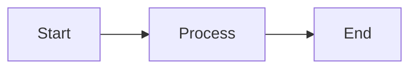

# profile_website
Website for my Freelancer-profile

A static website for Tom Seidel's freelancer profile, built with [Eleventy (11ty)](https://www.11ty.dev/).

## Features

- **Landing page** with hero, bio, tech stack, and availability info
- **Projects page** listing project references (managed via `src/_data/projects.json`)
- **Articles section** for technical writing (markdown files with front matter)
- **Mermaid diagram support** in articles (rendered via mermaid.js CDN)
- **Image support** in markdown content
- **Ansible deployment** script for easy server deployment

## Project Structure

```
profile_website/
├── src/
│   ├── _includes/          # Nunjucks layout templates
│   │   ├── base.njk        # Base HTML layout
│   │   └── article.njk     # Article page layout
│   ├── _data/
│   │   └── projects.json   # Project references data
│   ├── assets/
│   │   ├── css/styles.css  # Stylesheet
│   │   └── js/main.js      # JavaScript
│   ├── articles/           # Technical articles (markdown)
│   │   ├── index.md        # Articles listing page
│   │   └── *.md            # Individual articles
│   ├── projects/
│   │   └── index.md        # Projects listing page
│   └── index.md            # Landing page
├── deploy/
│   ├── playbook.yml        # Ansible deployment playbook
│   ├── inventory.ini       # Ansible inventory (configure your server)
│   └── templates/
│       └── nginx_site.conf.j2  # Nginx site config template
├── .eleventy.js            # Eleventy configuration
└── package.json
```

## Getting Started

### Prerequisites

- Node.js 18+
- npm

### Install dependencies

```bash
npm install
```

### Development

```bash
npm run serve
```

Opens a local server at `http://localhost:8080` with live reload.

### Build

```bash
npm run build
```

Output is written to the `dist/` directory.

## Adding Content

### New Article

Create a markdown file in `src/articles/`:

```markdown
---
layout: article.njk
title: "Your Article Title"
description: "A short description."
date: 2024-01-15
tags:
  - articles
  - Java
  - Cloud
---

Article content here. Supports **markdown**, images, and mermaid diagrams.

## Mermaid Diagram Example


```

### New Project Reference

Edit `src/_data/projects.json` and add an entry:

```json
{
  "title": "Project Name",
  "description": "What you did and achieved.",
  "technologies": ["Java", "Spring Boot", "Kubernetes"],
  "status": "completed",
  "period": "2023 – 2024"
}
```

Status can be: `completed`, `ongoing`, or `confidential`.

## Deployment

### Requirements on the target server

- A Linux server (Debian/Ubuntu recommended)
- SSH access with sudo
- Ansible installed on your local machine

### Steps

1. Build the site:
   ```bash
   npm run build
   ```

2. Configure your server in `deploy/inventory.ini`:
   ```ini
   [webservers]
   webserver ansible_host=YOUR_SERVER_IP ansible_user=ubuntu ansible_ssh_private_key_file=~/.ssh/id_rsa
   ```

3. Run the playbook:
   ```bash
   cd deploy
   ansible-playbook -i inventory.ini playbook.yml
   ```

   To deploy only updated content (skip nginx setup):
   ```bash
   ansible-playbook -i inventory.ini playbook.yml --tags content
   ```

The playbook will:
- Install and configure nginx
- Copy the built site to `/var/www/profile_website`
- Configure caching, gzip, and security headers
