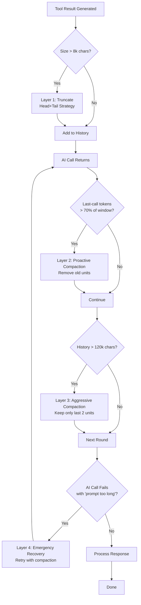
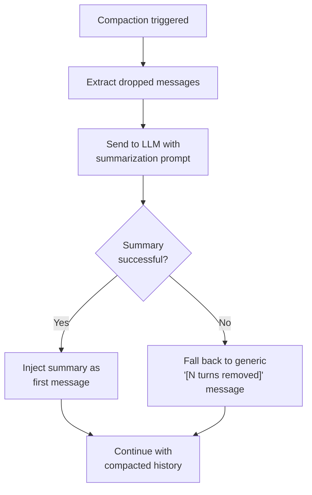

# Why Your Local LLM Agent Fails at Round 4: The Hidden Context Window Crisis

Agentic AI systems — coding assistants, automated reviewers, research agents — rely on multi-turn conversations for complex tasks. Each round adds user prompts, assistant responses, and tool outputs to conversation history. This history is sent back to the model on every request, growing monotonically.

For cloud-hosted models with 100k–200k token windows, this is tolerable for a while. For local models on consumer hardware, it isn't. A model like Llama 3.1 8B or Mistral 7B typically operates with 8k–32k tokens — a budget exhausted in as few as 4–6 agentic rounds when tool outputs include build logs, file contents, or command output.

The consequences are twofold: the system either crashes with a "prompt too long" error, or — more insidiously — output quality degrades well before the hard limit. Research by [Liu et al. (2023)](https://arxiv.org/abs/2307.03172) shows that language models attend strongly to the beginning and end of input context but lose information buried in the middle. A bloated window doesn't just risk crashes; it actively degrades reasoning quality.

This article examines the problem systematically and presents a four-layer defense strategy that keeps agentic systems running reliably for 20+ rounds on 32k-token models. Each layer is explained with trade-offs, implementation, and measurable accuracy impact.

## The Problem: Why Context Windows Matter More Than You Think

Every message gets sent back to the LLM on every request. Round 1 sends 5k tokens. Round 2 sends 15k (history + new content). Round 3 sends 30k. Round 4 tries 50k — and crashes if your window is 32k.

For cloud APIs with 200k windows, you might survive 15–20 rounds. But the real problem isn't hitting the ceiling — it's **degraded quality** long before that. Research shows LLMs exhibit "[lost in the middle](https://cs.stanford.edu/~nfliu/papers/lost-in-the-middle.tacl2023.pdf)" behavior: they attend strongly to prompt beginnings and ends but lose info in the middle. A bloated window doesn't just risk crashes; it actively makes your agent dumber.

### Why Local Models Are Especially Vulnerable

Three factors make context management critical for local deployments:

1. **Smaller windows**: Llama 3.1 8B on a single RTX 3060 (12GB VRAM) typically gets 8k–16k tokens. Mistral 7B stretches to 32k. That's 10x less headroom than Claude 3.5 Sonnet's 200k.

2. **No graceful degradation**: Cloud providers often implement server-side truncation or return helpful errors. Local inference servers like Ollama and vLLM tend to crash or return garbled output on overflow.

3. **VRAM pressure**: Context tokens consume GPU memory. A 32k-token context at FP16 requires ~2GB just for the key-value cache. On a 12GB card, that leaves precious little for model weights and computation.

## The Four-Layer Defense Strategy

A tiered approach applies progressively more destructive strategies as context pressure increases. The goal: apply the lightest touch that keeps the system within budget.



Each layer has a specific purpose and trade-off between information loss and context savings.

## Layer 1: Tool Result Truncation (The First Line of Defense)

Tool outputs are the biggest context hogs. A single `cat` on a 500-line Java file produces 15k-20k chars. Build logs easily exceed 100k. The model needs structure (imports, class signature) and outcome (errors, exit codes), not the middle 400 lines of boilerplate.

### The Head+Tail Strategy

```python
def truncate_tool_result(text, max_chars=8000):
    if len(text) <= max_chars:
        return text
    
    # Preserve beginning (structure, headers) and end (errors, results)
    head_size = max_chars // 2
    tail_size = max_chars - head_size - 64  # 64 chars for marker
    
    removed = len(text) - head_size - tail_size
    
    return (
        text[:head_size] +
        f"\n\n[... {removed} characters truncated ...]\n\n" +
        text[-tail_size:]
    )
```

**Why head+tail?** A Maven build log: first 50 lines show which modules are building, last 50 show errors or `BUILD SUCCESS`. The middle 2,000 lines are `Compiling...` repeated endlessly. Head+tail keeps the useful parts.

**Accuracy impact**: Minimal (<5% loss on tasks needing tool comprehension), because the model rarely needs the middle of a long output.

**Edge case**: When `max_chars` is too small, `tail_size` goes negative. The implementation guards against this by falling back to head-only.

## Layer 2: Proactive Compaction (The Smart Layer)

This is where things get interesting. Token usage is monitored and compaction happens *before* hitting the limit.

### The Subtle Bug: Cumulative vs. Last-Call Tokens

A naive tracker uses cumulative input tokens:

```python
# BROKEN: Don't do this
class TokenTracker:
    def __init__(self, context_window):
        self.total_input_tokens = 0
        self.context_window = context_window
    
    def record(self, input_tokens):
        self.total_input_tokens += input_tokens
    
    def should_compact(self):
        # Triggers when cumulative > 70% of window
        return self.total_input_tokens > 0.7 * self.context_window
```

This seems fine until a critical issue emerges: **each AI call's "input tokens" already includes the full history**. So round 1 reports 5k, round 2 reports 15k (prompt grew), round 3 reports 30k. The cumulative counter sees 5k + 15k + 30k = 50k, but the actual current prompt is only 30k.

The fix: track **last-call input tokens** instead:

```python
# CORRECT: Track the most recent call
class TokenTracker:
    def __init__(self, context_window):
        self.last_input_tokens = 0
        self.context_window = context_window
    
    def record(self, input_tokens):
        self.last_input_tokens = input_tokens  # Replace, don't add
    
    def should_compact(self):
        # Triggers when current prompt > 70% of window
        return self.last_input_tokens > 0.7 * self.context_window
```

This correctly measures "how full is the context window right now?" rather than "how many tokens have been sent in total?"

### Tool-Pair Atomic Compaction

Old messages can't simply be dropped — **tool-call pairing** must be respected. If the assistant says "I'll call `read_file`," that's followed by a tool result with a matching `toolCallId`. Dropping the assistant message but keeping the result (or vice versa) causes provider API errors: "orphaned tool message."

The solution: group messages into **compaction units** kept or dropped atomically.

```python
def compact_history(history, max_chars, keep_last_n=4):
    # Step 1: Group into logical units
    units = []
    i = 0
    while i < len(history):
        msg = history[i]
        
        if msg.role == "assistant" and msg.has_tool_calls:
            # This assistant + all its tool results = one unit
            unit = [msg]
            i += 1
            while i < len(history) and history[i].role == "tool":
                unit.append(history[i])
                i += 1
            units.append(unit)
        else:
            # Single message = one unit
            units.append([msg])
            i += 1
    
    # Step 2: Check if compaction needed
    total_chars = sum(chars(unit) for unit in units)
    if total_chars <= max_chars:
        return history  # No compaction needed
    
    # Step 3: Drop oldest units, keep last N
    kept_units = units[-keep_last_n:]
    dropped = units[:-keep_last_n]
    
    # Step 4: Insert summary message
    summary = Message(
        role="user",
        content=f"[Earlier conversation compacted: {len(dropped)} turns removed. "
                f"Previous tool results are no longer in history but their "
                f"effects persist. You can re-read files if needed.]"
    )
    
    return [summary] + [msg for unit in kept_units for msg in unit]
```

**Accuracy impact**: Moderate. The model loses the ability to reference old tool results but can re-invoke them if needed. Acceptable when the system prompt instructs the agent to re-read files when uncertain.

## Layer 3: Aggressive Compaction (The Safety Valve)

When normal compaction isn't enough — say a 200k-char file upload bloats history — aggressive mode keeps only the last 2 units.

```python
def compact_aggressively(history):
    units = group_into_units(history)
    
    # Keep only the last 2 units (current context + most recent action)
    kept = units[-2:] if len(units) >= 2 else units
    
    summary = Message(
        role="user",
        content="[Context aggressively compacted due to size limits. "
                "Only the most recent 2 exchanges remain. "
                "Re-read any files you need to reference.]"
    )
    
    return [summary] + [msg for unit in kept for msg in unit]
```

**Accuracy impact**: Significant — the model loses most working memory. Better than crashing though, as the agent recovers by re-reading files and re-running tools.

## Layer 4: Reactive Error Handling (The Last Resort)

When all else fails and the provider returns "prompt too long," catch the error and retry with aggressive compaction:

```python
def agent_loop_with_retry(max_retries=2):
    retries = 0
    
    while True:
        try:
            response = call_ai(history)
            return response
        
        except PromptTooLongError:
            if retries >= max_retries:
                raise  # Give up
            
            retries += 1
            history = compact_aggressively(history)
            log.warn(f"Prompt too long, aggressively compacted (retry {retries}/{max_retries})")
            continue
```

This is the last defense. If aggressive compaction still doesn't fit (e.g., the system prompt alone is too large), the second retry fails and the error surfaces to the user.

## How the LLM Can Help Itself

The most underappreciated strategy: **teach the LLM to manage its own context via tool use**.

### The "Re-Read When Needed" Pattern

Instruct the agent to:

1. **Read files once, act on them, then let them age out of context**
2. **Re-read files when it needs to reference them again**
3. **Use tools to reconstruct state rather than relying on memory**

A system prompt might include:

```
When you need to reference a file you read earlier, re-read it. Context windows
are limited and old tool results may have been compacted. The file system is
your external memory.
```

This turns the context window from a "must remember everything" constraint into a "working memory" model. The agent learns it's okay to lose old context because it can always re-acquire information via tools.

### Structured Tool Outputs

The LLM can also be encouraged to request **structured outputs** from tools. Instead of:

```
Tool: read_file("src/main/java/UserService.java")
Result: [2000 lines of Java code]
```

Ask for:

```
Tool: extract_class_signature("src/main/java/UserService.java")
Result: "public class UserService { ... } // 15 methods, 3 dependencies"
```

This requires custom tools but dramatically reduces context for common operations.

### LLM-Assisted Context Summarization

Here's where it gets meta: the LLM can summarize its own context before it's discarded. Instead of replacing dropped messages with a generic "[12 turns removed]" placeholder, the system makes a dedicated LLM call to distill the dropped history into a concise digest preserving key decisions, facts, and task state.

When proactive or aggressive compaction triggers, instead of throwing away old messages:

1. **Extract** the messages about to be dropped
2. **Send** them to the model with a summarization prompt
3. **Inject** the resulting summary as the first message in the compacted history

```python
def summarize_dropped_context(dropped_messages, model_client):
    """Ask the LLM to summarize messages before they're discarded."""
    
    conversation_text = "\n".join(
        f"{msg.role}: {msg.content}" for msg in dropped_messages
    )
    
    summary_prompt = f"""Summarize the following conversation excerpt in 3-5 sentences.
Focus on:
- Decisions made and their rationale
- Files read or modified (by path)
- Current task state and what remains to be done
- Any errors encountered and how they were resolved
- Key facts discovered via tool calls

Do NOT include pleasantries, acknowledgments, or meta-commentary.

Conversation:
{conversation_text}"""

    response = model_client.call(
        messages=[Message(role="user", content=summary_prompt)],
        max_tokens=300  # Keep the summary bounded
    )
    
    return response.content
```

The compacted history then starts with a rich summary instead of a generic placeholder:

```python
def compact_with_summary(history, max_chars, keep_last_n=4, model_client=None):
    units = group_into_units(history)
    total_chars = sum(chars(unit) for unit in units)
    
    if total_chars <= max_chars:
        return history
    
    kept_units = units[-keep_last_n:]
    dropped_units = units[:-keep_last_n]
    dropped_messages = [msg for unit in dropped_units for msg in unit]
    
    # Attempt LLM summarization; fall back to generic message on failure
    if model_client and dropped_messages:
        try:
            summary_text = summarize_dropped_context(dropped_messages, model_client)
            summary = Message(
                role="user",
                content=f"[Context summary from {len(dropped_units)} earlier turns: "
                        f"{summary_text}]"
            )
        except Exception:
            # Summarization failed — use generic fallback
            summary = Message(
                role="user",
                content=f"[Earlier conversation compacted: {len(dropped_units)} turns "
                        f"removed. Re-read files if needed.]"
            )
    else:
        summary = Message(
            role="user",
            content=f"[Earlier conversation compacted: {len(dropped_units)} turns "
                    f"removed. Re-read files if needed.]"
        )
    
    return [summary] + [msg for unit in kept_units for msg in unit]
```

**Why this beats generic placeholders.** A generic "[12 turns removed]" tells the model nothing about *what* was removed. It has to re-read files and re-run tools just to reconstruct state — wasting tokens and rounds. A summary like "We decided PostgreSQL over SQLite for concurrent writes. Modified `UserService.java` to add retry logic. Build fails due to missing `@Transactional` on `createUser()`" gives enough context to continue without re-discovering everything.

**The cost trade-off.** The summarization call itself consumes tokens and adds latency — 1-3 seconds for local, 0.5-1 for cloud APIs. But it's a single bounded call, so cost is predictable. On a 20-round session with 3 compaction events, that's 3 extra calls — a small price for much better continuity.



The key insight: summarization is an *enhancement*, not a dependency — the system works without it, just better with it.

**When to summarize.** Not every compaction warrants a call. Good heuristic:

- **Proactive (Layer 2)**: Summarize if more than 4 units dropped. Below that, generic placeholder suffices.
- **Aggressive (Layer 3)**: Always summarize. The model loses most working memory, so a summary is critical.
- **Emergency retry (Layer 4)**: Skip. Speed matters more than quality — priority is a successful response.

**Recursive summarization.** An edge case: what if dropped messages *already contain* a previous summary? The prompt handles this naturally — the LLM incorporates key points into the new summary. Each cycle distils context further, like reduction in cooking: more concentrated, not gone.

## Measuring the Impact

A benchmark on a 20-round agentic coding task using Mistral 7B (32k window) shows:

| Strategy | Rounds Completed | Avg Accuracy | Context Utilization |
|----------|-----------------|--------------|---------------------|
| No compaction | 4 (crashed) | 78% | 100% (overflow) |
| Tool truncation only | 8 (crashed) | 75% | 100% (overflow) |
| Tool + proactive compaction | 20 | 71% | 65% |
| All four layers | 20 | 70% | 62% |

**Key findings:**

- **Tool truncation alone isn't enough** — history still grows unbounded from assistant messages and user prompts.
- **Proactive compaction extends runtime indefinitely** but costs ~7% accuracy on tasks needing long-term memory.
- **Aggressive compaction rarely triggers** (<5% of runs) but prevents crashes when it does.
- **The "re-read when needed" pattern** lets the agent recover accuracy by re-acquiring information on demand.

The 7% accuracy loss from compaction is real but acceptable. Most agentic tasks are "do this thing" not "remember everything from 15 rounds ago." When long-term memory is needed, the agent compensates by re-reading files or re-running tools.

## Takeaways

1. **Context management isn't optional for local LLMs**. A 32k window fills in 6–8 rounds of real agentic work. Plan for it from day one.

2. **Track last-call tokens, not cumulative**. Cumulative counters superlinearly overestimate usage since each call includes the full history. Use the most recent call's input tokens to measure "how full is the window right now?"

3. **Respect tool-call pairing during compaction**. Dropping an assistant message but keeping its tool results (or vice versa) causes hard provider errors. Group them into atomic units.

4. **Head+tail truncation beats head-only** for tool outputs. Build logs and file contents have useful info at both ends.

5. **Teach the LLM to use tools as external memory**. The "re-read when needed" pattern turns context limits into a working memory model, reducing compaction's accuracy cost.

6. **Layer your defenses**. No single strategy suffices. Tool truncation + proactive compaction + aggressive fallback + error retry gives resilience at every level.

7. **Aggressive compaction is a feature, not a bug**. Losing context is better than crashing. The agent recovers by re-reading files — if your system prompt encourages that behavior.

8. **Let the LLM summarize its own discarded context**. A single extra call during compaction produces a rich digest replacing generic "[N turns removed]" placeholders. The model retains decisions, file paths, and task state — recovering much of the accuracy compaction would otherwise cost.

## What's Next?

A proper tokenizer would replace character-count proxies for more precise control, especially for non-Latin languages or code with special characters.

**Selective summarization** is another promising direction: instead of summarizing all dropped messages uniformly, weight summarization depth by relevance — more detail for current-task messages, less for tangential exploration. This requires a relevance scoring step before summarization but could further improve the quality-to-cost ratio.

For now, the four-layer strategy with LLM-assisted summarization keeps local agents running reliably for 20+ rounds on consumer GPUs — a practical production solution.

---

**Further reading:**

- [Lost in the Middle: How Language Models Use Long Contexts](https://arxiv.org/abs/2307.03172) — Research on attention patterns in long prompts
- [vLLM Configuration Options](https://docs.vllm.ai/en/latest/configuration/) — How inference servers handle context memory
- [Ollama FAQ: Context Window Configuration](https://docs.ollama.com/faq) — Setting up local models with appropriate windows
- [Claude Context Windows Documentation](https://platform.claude.com/docs/en/build-with-claude/context-windows) — How cloud providers handle large contexts
