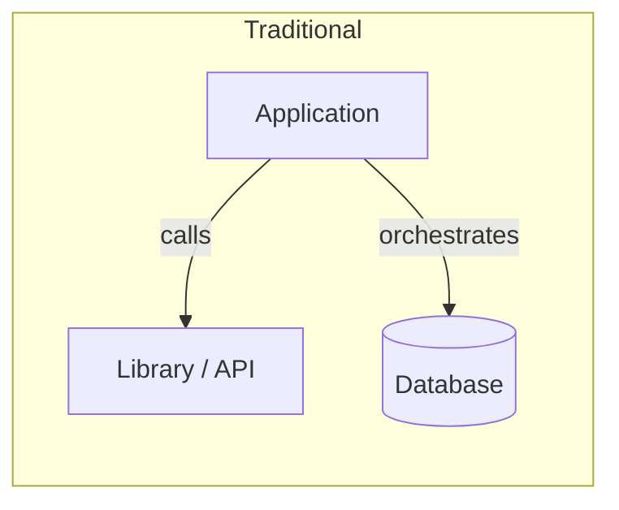
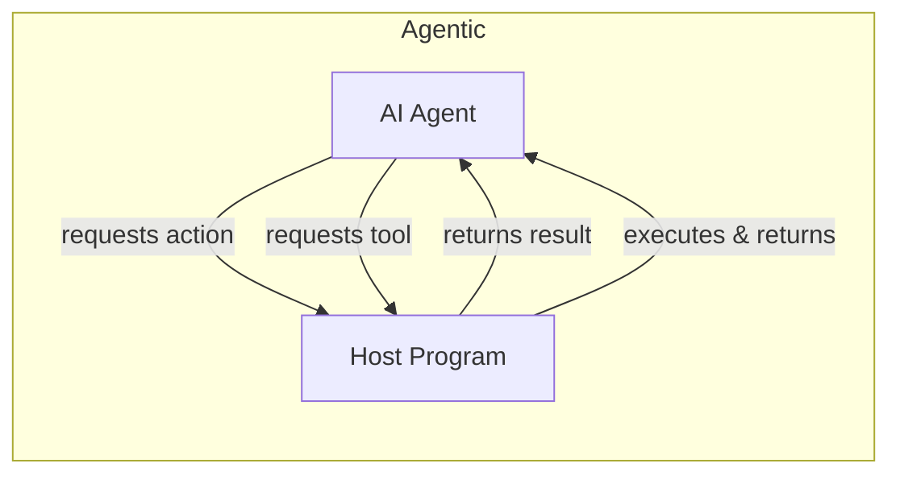
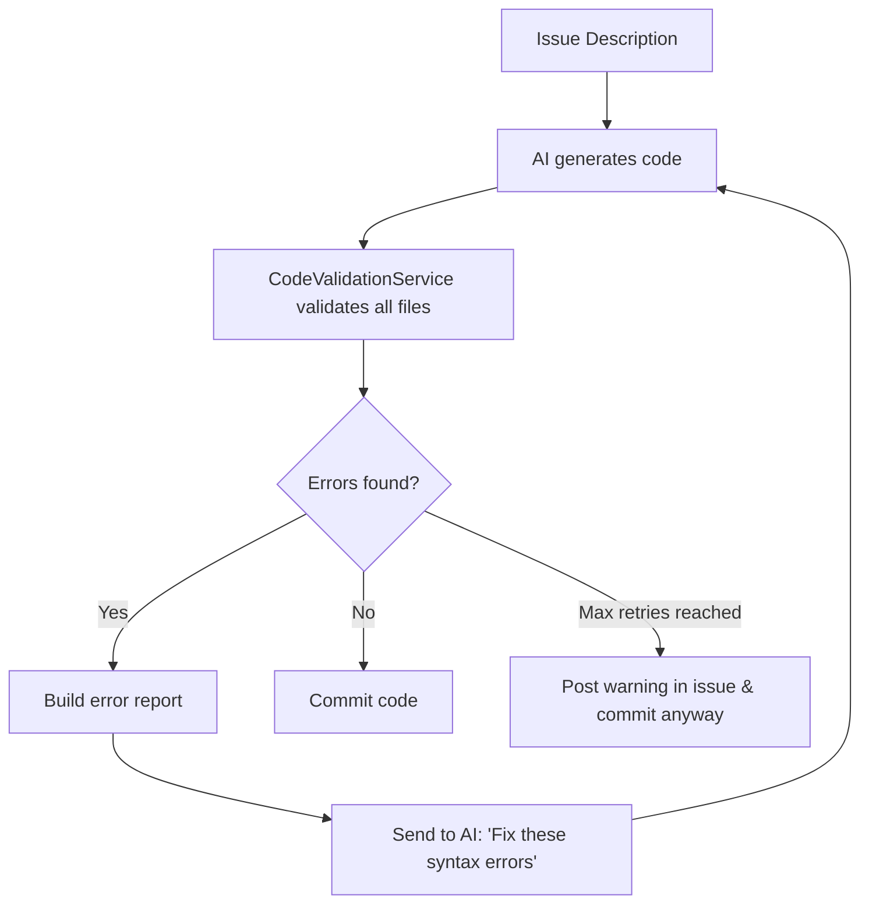
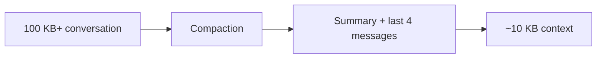
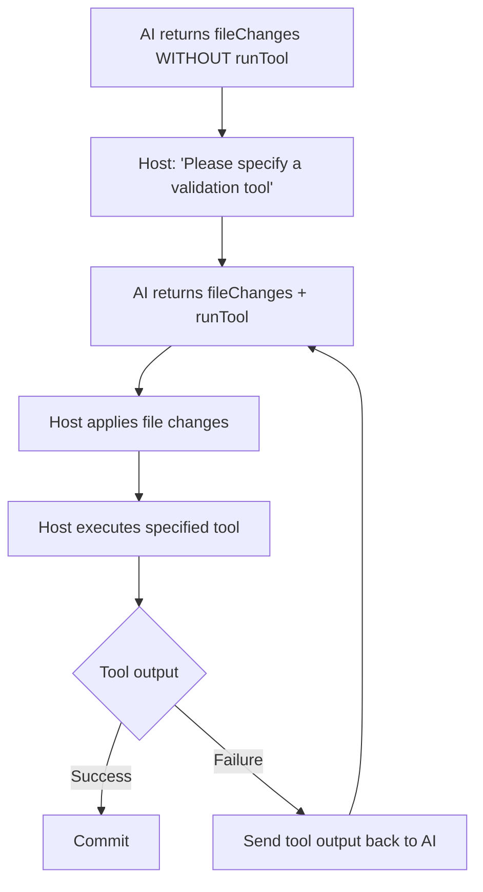
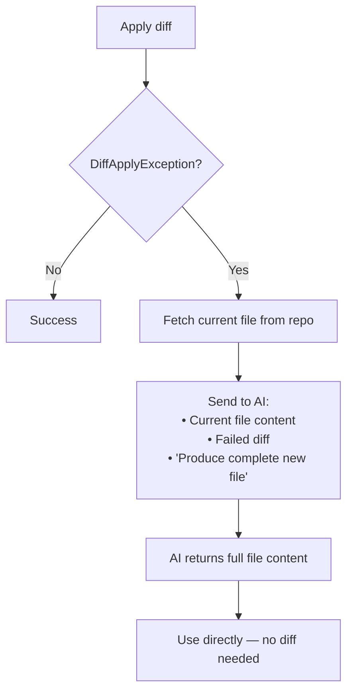

Building software with an AI agent at its core is fundamentally different from traditional application development. Over the course of nine iterations, I developed an AI agent that reads GitHub issues, generates implementation code, validates it, and commits the result — all autonomously. This article distils the key lessons learned along the way.

## The Paradigm Shift: Inversion of Control

The single biggest mental shift when building agentic systems is the **inversion of control flow**. In traditional software, the application owns the business logic and orchestrates every step. In an agentic system, the AI holds the business logic — the surrounding program merely acts as a communication partner, executing commands on the agent's behalf.





Your application becomes an **execution environment** for the agent. It provides tools, fetches context, applies file changes, and reports results — but it no longer decides *what* to do. The agent decides.

## The Tightrope Walk: Context Window vs. Output Quality

One of the most persistent challenges is balancing the context window. Too little context, and the AI hallucinates imports, invents method signatures, or misses existing patterns. Too much context, and the model loses focus, produces lower-quality output, or exceeds token limits.

> The sweet spot shifts with every model generation, but the tension never goes away.

This interplay shaped almost every iteration of the agent.

## Core Principles

Before diving into the iterations, here are the overarching lessons:

1. **Always give the AI the ability to request more information.** Never assume your initial context is sufficient. Let the agent ask for files, type definitions, or documentation on demand.
2. **Define a protocol in the system prompt for structured output** — but build your application to be resilient against protocol violations. The AI will *sometimes* deviate from the agreed JSON schema, return partial responses, or mix formats. Your parser must handle this gracefully.
3. **The agent is the orchestrator** — your code is the infrastructure.

## Iteration 1 — Naive Generate-and-Validate Loop

The first version was straightforward: send the issue description to the AI, receive generated code, then validate it.



**What worked:** The basic loop caught obvious syntax errors and gave the AI a chance to self-correct.

**What didn't work:** The AI frequently generated code that referenced classes, methods, or interfaces it had never seen. Without sufficient context about the existing codebase, the output was often structurally correct but semantically wrong.

## Iteration 2 — Smarter Context Gathering

The root cause from Iteration 1 was clear: the AI didn't know enough about the existing codebase. The `fetchRelevantFileContents()` method was significantly improved:

- **Package awareness:** When a file is mentioned, all files in the same package are loaded.
- **Partial name matching:** The word "Task" in an issue matches `Task.java`, `TaskService.java`, `TaskRepository.java`, etc.
- **Domain structure recognition:** Files in `/domain/`, `/model/`, `/entity/`, `/config/`, `/dto/`, `/repository/`, `/service/`, and `/controller/` directories are included when they relate to the issue.
- **Increased file limit:** From 15 to 30 files.

This gave the AI visibility into existing method signatures, interface definitions, inheritance hierarchies, and repository methods — drastically reducing hallucinated references.

**Lesson:** Context quality matters more than prompt engineering. A perfectly worded prompt with missing context will always lose to a mediocre prompt with complete context.

## Iteration 3 — Conversation Compaction

With richer context and multi-turn code review conversations, the context window filled up fast. After several rounds of back-and-forth, the conversation could easily exceed 100 KB of tokens.

The solution: **automatic compaction** after every code review interaction. The system retains only the last four messages plus a short summary of the earlier conversation.



**Lesson:** LLMs work best with focused context. Aggressively summarise historical turns — the AI doesn't need the full transcript, just the current state and a brief recap.

## Iteration 4 — Prompt Deduplication

A careful audit of all prompts revealed massive redundancy:

- Instructions already present in the system prompt were repeated in every user prompt.
- The full repository tree was sent with every continuation, even though the AI already had it from the previous turn.
- Verbose formatting instructions (Markdown headers, extra blank lines) were duplicated.

**Changes made:**
- `"Output your response as a JSON object with the structure described in the system prompt"` → `"Output JSON per system prompt format"`
- `treeContext` removed from `buildContinuationPrompt` — the AI retains it from the conversation history.
- Repeated formatting directives eliminated.

**Lesson:** Treat your prompts like production code. Audit them for duplication, dead instructions, and unnecessary verbosity. Every wasted token is context the AI could have used for actual reasoning.

## Iteration 5 — Diff-Based Updates and Dynamic File Requests

This was the most impactful single iteration. Two major features were introduced:

### Diff-Based Changes

Instead of returning entire files for every small change, the AI now returns **SEARCH/REPLACE diffs**:

```json
{
  "fileChanges": [
    {
      "path": "src/main/java/com/example/Task.java",
      "operation": "UPDATE",
      "diff": "<<<<<<< SEARCH\nprivate String name;\n=======\nprivate String name;\nprivate String description;\n>>>>>>> REPLACE"
    }
  ]
}
```

A new `DiffApplyService` applies these blocks to the actual file content.

### Dynamic File Requests

The AI can now respond with a **file request** instead of code changes:

```json
{
  "summary": "Need more context about the repository interface",
  "requestFiles": ["src/main/java/com/example/TaskRepository.java", "pom.xml"]
}
```

The host program fetches the requested files and continues the conversation.

**Token savings were dramatic:**

| Scenario | Before | After | Saving |
|---|---|---|---|
| Small change in a 500-line file | ~500 lines | ~10 lines (diff) | ~98% |
| Follow-up without new files | Tree + file list | Only comment | ~90% |
| Iterative requests | All files again | Only requested files | ~70% |

**Lesson:** Give the AI the tools to be efficient. Diff-based output and on-demand file requests transform a chatty, wasteful interaction into a focused, surgical one.

## Iteration 6 — Robust Diff Application

Real-world diffs from the AI are messy. The `DiffApplyService` had to handle numerous edge cases:

- **Empty SEARCH blocks** — content is appended to the file.
- **Placeholder comments** like `/* Add existing... */` — treated as append operations.
- **Append patterns** — when the REPLACE block starts with the SEARCH content and adds more, only the new part is appended.
- **Trailing whitespace differences** — a fuzzy match is attempted before failing.

Additionally, the `IssueImplementationService` was ignoring AI responses that contained `requestFiles` but no `fileChanges`, returning `null` instead. The fix:

- Detect `requestFiles` even when `fileChanges` is empty.
- Fetch the requested files and continue the conversation.
- Allow a maximum of **three rounds** of file requests to prevent infinite loops.

**Lesson:** The interface between AI output and your application is inherently fuzzy. Build robust parsers, add fallback strategies, and always cap iteration counts.

## Iteration 7 — AI-Driven Validation with Tools

A fundamental architectural change: **remove built-in validators entirely** and let the AI decide how to validate its own output.

The agent prompt was updated to make tool usage mandatory:

> *"IMPORTANT: You MUST include `runTool` in every response that contains `fileChanges`. The bot does not have built-in validators — only you can determine how to validate the code by executing external tools."*

The AI now specifies a validation command (e.g., `mvn compile`, `npm run build`, `gradle check`) alongside its code changes. If it forgets, the host program sends it back with a reminder.



**Lesson:** The AI often knows better than a hardcoded validator what constitutes "correct" in a given context. A Java project needs `mvn compile`; a Node project needs `npm run build`; a Python project might need `pytest`. Let the agent choose.

## Iteration 8 — Resilient JSON Parsing

With complex multi-turn conversations, the AI occasionally produced truncated or malformed JSON — especially near token limits. The `repairTruncatedJson` method was overhauled:

- **Check completeness first:** Verify whether brackets are balanced before attempting any repair.
- **Only truncate genuinely incomplete JSON** — previously, valid JSON was sometimes mangled by premature repair attempts.
- **Add `@NoArgsConstructor`** to all DTO classes to ensure Jackson can deserialize partial objects.
- **Parse `runTool`** as a proper typed object (`AiToolRequest`) instead of a raw map.

**Lesson:** When you define a structured protocol in the system prompt, the AI will follow it *most of the time* — perhaps 95%. Your application must handle the other 5% gracefully. Invest in resilient parsing, not stricter prompts.

## Iteration 9 — AI-Assisted Diff Recovery

Even with all the fuzzy matching from Iteration 6, diffs still sometimes failed to apply — typically because the file had been modified by a previous step in the same conversation, and the SEARCH block no longer matched.

The elegant solution: **ask the AI to resolve it**.

When a `DiffApplyException` occurs:

1. Fetch the current file content from the repository.
2. Send both the current content and the failed diff to the AI.
3. Ask it to produce the complete new file content.



This is far more robust than implementing ever-more-complex matching strategies in the `DiffApplyService`. The AI sees the actual current state of the file and can produce the intended result directly.

**Lesson:** When your deterministic code fails, don't add more deterministic complexity — delegate back to the AI. It can reason about intent in ways that string matching never will.

## Summary of Key Takeaways

After nine iterations, these are the principles I'd carry into any agentic system:

| Principle | Detail |
|---|---|
| **Inversion of control** | The agent drives the logic; your app is the execution environment. |
| **Context is everything** | Invest heavily in smart, dynamic context gathering. |
| **Let the agent ask for more** | Never assume you've provided enough information upfront. |
| **Define a protocol, but be resilient** | Structured output formats are essential, but the AI will violate them. Build robust parsers. |
| **Minimise token waste** | Use diffs, summaries, and deduplication to keep the context window focused. |
| **Delegate validation to the agent** | The AI knows the build system better than a hardcoded checker. |
| **Use the AI to fix AI failures** | When diff application or parsing fails, ask the AI to resolve it. |

Building agentic systems is an exercise in designing for uncertainty. The AI is powerful but imprecise. Your surrounding infrastructure must be resilient, adaptive, and willing to hand control back to the agent when deterministic approaches fail. The result is a system that is more capable than either part alone.

