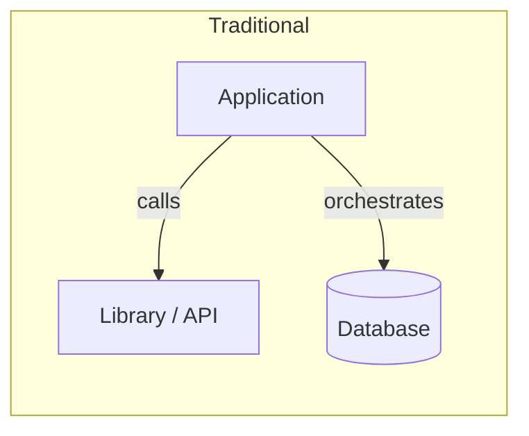
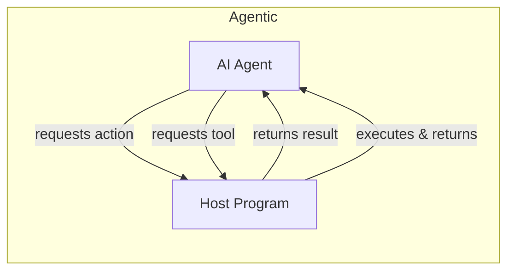
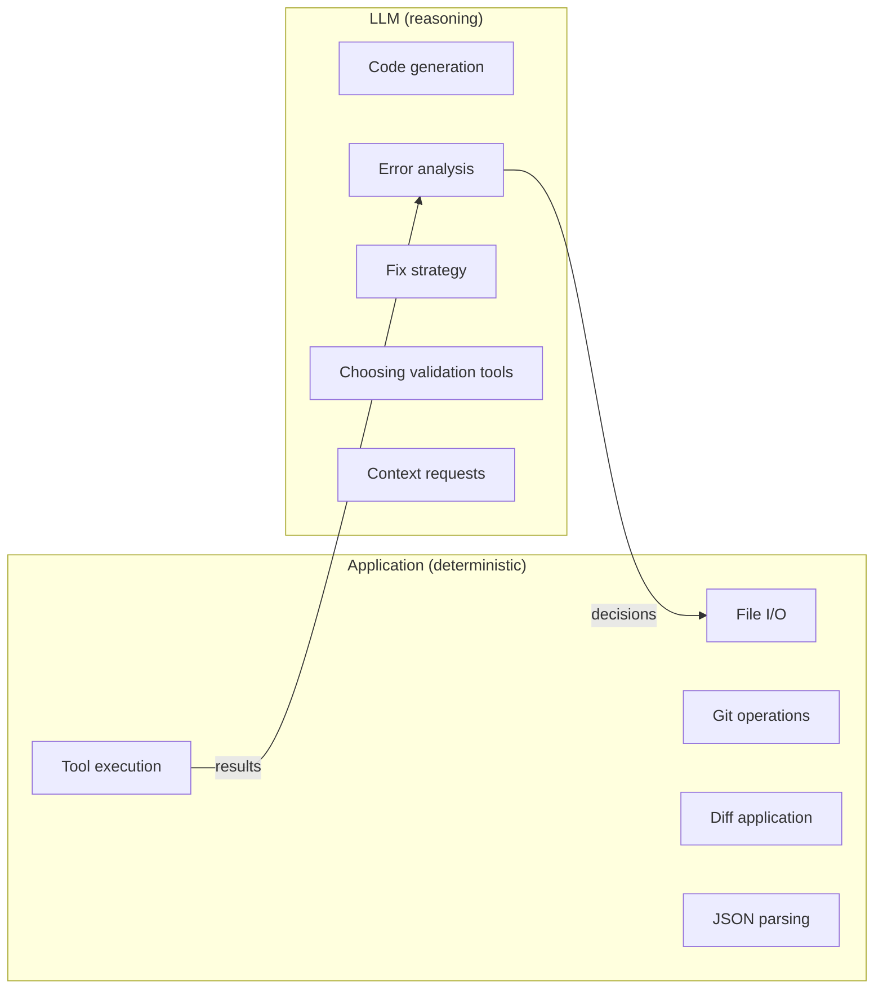
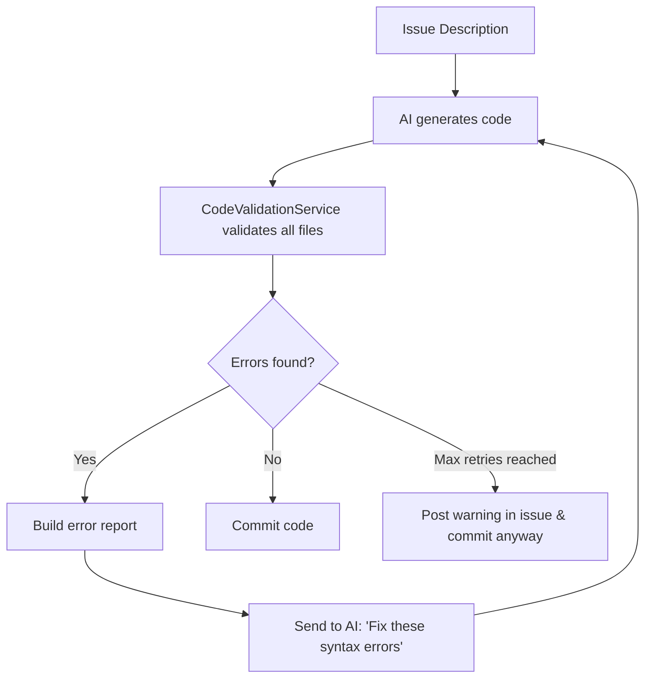
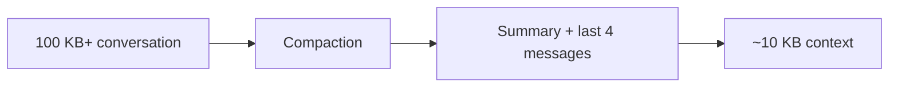
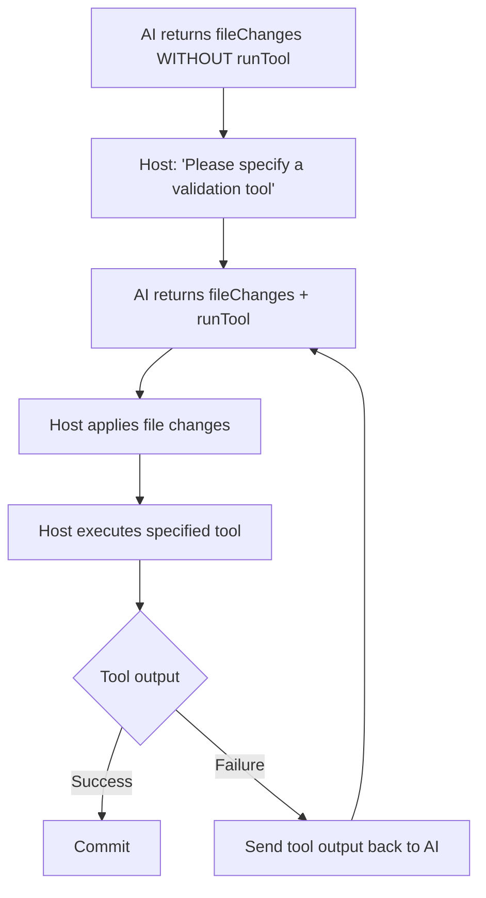
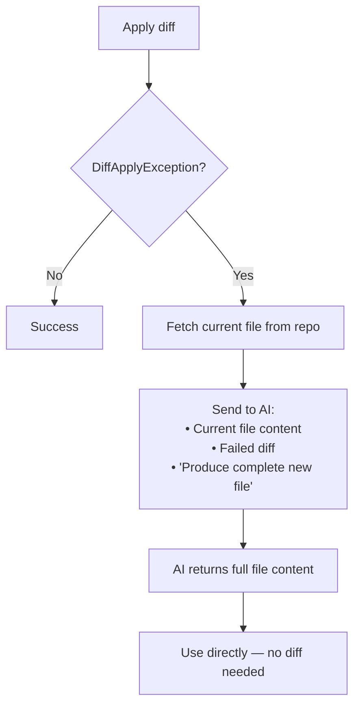
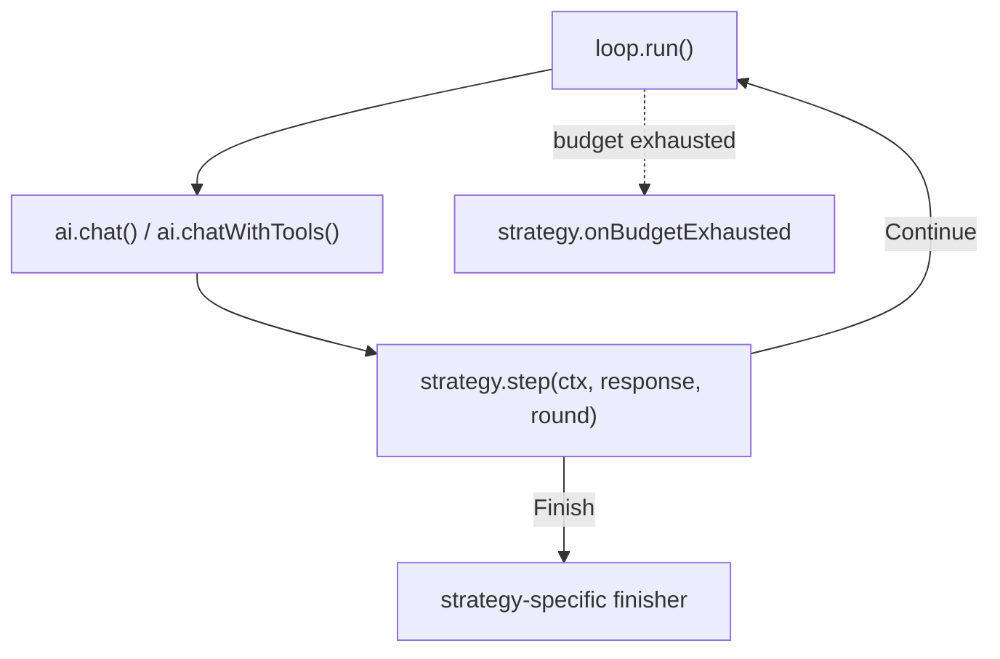

Building software with an AI agent at its core is fundamentally different from traditional application development. Over the course of thirteen iterations — nine on the agent's behaviour, four more on the surrounding *architecture* of the host — I developed an AI agent that reads GitHub/Gitea issues, generates implementation code, validates it, and commits the result, all autonomously. This article distils the key lessons learned along the way.

## The Paradigm Shift: Inversion of Control

The single biggest mental shift when building agentic systems is the **inversion of control flow**. In traditional software, the application owns the business logic and orchestrates every step. In an agentic system, a significant portion of that decision-making shifts to the AI — the surrounding program increasingly acts as a communication partner, executing commands on the agent's behalf.





Your application becomes, to a large degree, an **execution environment** for the agent. It provides tools, fetches context, applies file changes, and reports results — while the agent takes on much of the reasoning about *what* to do. In practice, the split is not black and white — which is exactly what the next section explores.

## Designing the Agent Flow: What to Keep, What to Delegate

Once you accept the inversion of control, the next critical question is: **which actions belong in your application, and which do you delegate to the LLM?** This is not an all-or-nothing decision — it's a spectrum, and every point on it has trade-offs.

### Keeping Logic in the Application

Deterministic steps — file I/O, git operations, API calls, JSON parsing, diff application — are natural candidates for application-side logic.

**Advantages:**
- **Predictable and fast.** Same input, same output, every time. No API latency, no token cost.
- **Testable.** You can write unit tests with clear assertions.
- **Debuggable.** Stack traces, breakpoints, and logging work exactly as expected.

**Disadvantages:**
- **Rigid.** You must anticipate every edge case upfront. An unexpected file format or an unusual error message breaks the flow.
- **More code to maintain.** Every special case becomes an `if` branch or a new parser.

### Delegating Logic to the LLM

Reasoning tasks — deciding *what* to change, interpreting error messages, choosing a fix strategy, analysing code structure — are where the LLM excels.

**Advantages:**
- **Flexible and adaptive.** The model handles novel situations without explicit programming.
- **Reduces code complexity.** A single prompt can replace hundreds of lines of hand-coded decision trees.
- **Understands intent.** The AI can reason about *why* something should change, not just *what* the syntax rules say.

**Disadvantages:**
- **Non-deterministic.** The same input can produce different outputs on each run.
- **Slower.** Each LLM call adds 5–30 seconds of latency depending on the model and input size.
- **Token cost.** Every delegation costs money and consumes context window space.
- **Hallucination risk.** The model may confidently produce incorrect results.
- **Harder to test.** Assertions on LLM output are inherently fuzzy.

### Finding the Right Split

In practice, the division that worked best for our code generation agent was:



The guiding principle: **if a step requires understanding intent or adapting to ambiguity, delegate it. If it requires reliability and speed, keep it in the application.** As you will see throughout the iterations below, we gradually moved *more* logic to the AI side — not because we wanted to, but because the deterministic alternatives kept failing on edge cases.

## The Tightrope Walk: Context Window vs. Output Quality

One of the most persistent challenges is balancing the context window. Too little context, and the AI hallucinates imports, invents method signatures, or misses existing patterns. Too much context, and the model loses focus, produces lower-quality output, or exceeds token limits.

> The sweet spot shifts with every model generation, but the tension never goes away.

This interplay shaped almost every iteration of the agent.

## The Iteration Dilemma: How Many Loops?

Closely related to the context problem is the question of **how many iterations to allow** between your application and the LLM. LLMs have a remarkable ability to improve their output when given feedback — a compilation error sent back to the model often results in a correct fix on the second attempt. This makes iterative correction loops very attractive.

But iteration comes at a price:

- **Time.** Each round-trip adds 10–30 seconds of latency. Three retry loops turn a 15-second task into a two-minute task.
- **Context bloat.** Every iteration appends messages to the conversation — the error report, the AI's response, the next error report. The context window fills up fast, which degrades output quality (see above).
- **Hallucination drift.** Counter-intuitively, too many iterations can make things *worse*. After three or four failed attempts, the AI tends to "drift" — introducing new errors while fixing old ones, inventing methods that don't exist, or producing solutions that look plausible but are semantically wrong. The model starts optimising for *passing the immediate check* rather than *being correct*.
- **Cost.** Each iteration consumes tokens. With large context windows, a single retry can cost as much as the original request.

### Practical Guards

Through experimentation, we arrived at the following guidelines:

- **Hard caps on every loop.** No open-ended retries. We used 3 rounds for file requests, 5 rounds for code validation loops, and 3 rounds for diff recovery attempts.
- **Progress monitoring.** If the error count isn't decreasing between iterations, abort early. An AI that produces *more* errors after a fix attempt is unlikely to recover.
- **Compaction between rounds.** Summarise earlier turns aggressively to keep the context lean (see Iteration 3).
- **Escalation, not repetition.** If simple "fix this error" prompts fail twice, escalate to a richer strategy — provide more context, rephrase the problem, or fall back to a full file regeneration instead of incremental fixes.

> **Rule of thumb:** If your agent hasn't solved the problem in three iterations, throwing more iterations at it is unlikely to help — you need a different strategy, not more attempts.

## Core Principles

Before diving into the iterations, here are the overarching lessons:

1. **Always give the AI the ability to request more information.** Never assume your initial context is sufficient. Let the agent ask for files, type definitions, or documentation on demand.
2. **Define a protocol in the system prompt for structured output** — but build your application to be resilient against protocol violations. The AI will *sometimes* deviate from the agreed JSON schema, return partial responses, or mix formats. Your parser must handle this gracefully.
3. **The agent drives the reasoning** — your code provides the infrastructure and guardrails.

## Iteration 1 — Naive Generate-and-Validate Loop

The first version was straightforward: send the issue description to the AI, receive generated code, then validate it.



**What worked:** The basic loop caught obvious syntax errors and gave the AI a chance to self-correct.

**What didn't work:** The AI frequently generated code that referenced classes, methods, or interfaces it had never seen. Without sufficient context about the existing codebase, the output was often structurally correct but semantically wrong.

## Iteration 2 — Smarter Context Gathering

The root cause from Iteration 1 was clear: the AI didn't know enough about the existing codebase. The `fetchRelevantFileContents()` method was significantly improved:

- **Package awareness:** When a file is mentioned, all files in the same package are loaded.
- **Partial name matching:** The word "Task" in an issue matches `Task.java`, `TaskService.java`, `TaskRepository.java`, etc.
- **Domain structure recognition:** Files in `/domain/`, `/model/`, `/entity/`, `/config/`, `/dto/`, `/repository/`, `/service/`, and `/controller/` directories are included when they relate to the issue.
- **Increased file limit:** From 15 to 30 files.

This gave the AI visibility into existing method signatures, interface definitions, inheritance hierarchies, and repository methods — drastically reducing hallucinated references.

**Lesson:** Context quality matters more than prompt engineering. A perfectly worded prompt with missing context will always lose to a mediocre prompt with complete context.

## Iteration 3 — Conversation Compaction

With richer context and multi-turn code review conversations, the context window filled up fast. After several rounds of back-and-forth, the conversation could easily exceed 100 KB of tokens.

The solution: **automatic compaction** after every code review interaction. The system retains only the last four messages plus a short summary of the earlier conversation.



**Lesson:** LLMs work best with focused context. Aggressively summarise historical turns — the AI doesn't need the full transcript, just the current state and a brief recap.

## Iteration 4 — Prompt Deduplication

A careful audit of all prompts revealed massive redundancy:

- Instructions already present in the system prompt were repeated in every user prompt.
- The full repository tree was sent with every continuation, even though the AI already had it from the previous turn.
- Verbose formatting instructions (Markdown headers, extra blank lines) were duplicated.

**Changes made:**
- `"Output your response as a JSON object with the structure described in the system prompt"` → `"Output JSON per system prompt format"`
- `treeContext` removed from `buildContinuationPrompt` — the AI retains it from the conversation history.
- Repeated formatting directives eliminated.

**Lesson:** Treat your prompts like production code. Audit them for duplication, dead instructions, and unnecessary verbosity. Every wasted token is context the AI could have used for actual reasoning.

## Iteration 5 — Diff-Based Updates and Dynamic File Requests

This was the most impactful single iteration. Two major features were introduced:

### Diff-Based Changes

Instead of returning entire files for every small change, the AI now returns **SEARCH/REPLACE diffs**:

```json
{
  "fileChanges": [
    {
      "path": "src/main/java/com/example/Task.java",
      "operation": "UPDATE",
      "diff": "<<<<<<< SEARCH\nprivate String name;\n=======\nprivate String name;\nprivate String description;\n>>>>>>> REPLACE"
    }
  ]
}
```

A new `DiffApplyService` applies these blocks to the actual file content.

### Dynamic File Requests

The AI can now respond with a **file request** instead of code changes:

```json
{
  "summary": "Need more context about the repository interface",
  "requestFiles": ["src/main/java/com/example/TaskRepository.java", "pom.xml"]
}
```

The host program fetches the requested files and continues the conversation.

**Token savings were dramatic:**

| Scenario | Before | After | Saving |
|---|---|---|---|
| Small change in a 500-line file | ~500 lines | ~10 lines (diff) | ~98% |
| Follow-up without new files | Tree + file list | Only comment | ~90% |
| Iterative requests | All files again | Only requested files | ~70% |

**Lesson:** Give the AI the tools to be efficient. Diff-based output and on-demand file requests transformed a chatty, wasteful interaction into a focused, surgical one.

In hindsight, though, this was an important *transitional* design, not the final one. Diff-based updates reduced token usage, but they also introduced a fragile mini-language that the host application had to interpret and repair.

## Iteration 6 — Robust Diff Application

Real-world diffs from the AI are messy. The `DiffApplyService` had to handle numerous edge cases:

- **Empty SEARCH blocks** — content is appended to the file.
- **Placeholder comments** like `/* Add existing... */` — treated as append operations.
- **Append patterns** — when the REPLACE block starts with the SEARCH content and adds more, only the new part is appended.
- **Trailing whitespace differences** — a fuzzy match is attempted before failing.

Additionally, the `IssueImplementationService` was ignoring AI responses that contained `requestFiles` but no `fileChanges`, returning `null` instead. The fix:

- Detect `requestFiles` even when `fileChanges` is empty.
- Fetch the requested files and continue the conversation.
- Allow a maximum of **three rounds** of file requests to prevent infinite loops.

**Lesson:** The interface between AI output and your application is inherently fuzzy. Build robust parsers, add fallback strategies, and always cap iteration counts.

That said, there is a deeper lesson here: every extra recovery rule in the host is a signal that the protocol itself may be too brittle. If you keep adding fuzzy matching, placeholder handling, and recovery paths, you may be compensating for the wrong abstraction.

## Iteration 7 — AI-Driven Validation with Tools

A fundamental architectural change: **remove built-in validators entirely** and let the AI decide how to validate its own output.

The agent prompt was updated to make tool usage mandatory:

> *"IMPORTANT: You MUST include `runTool` in every response that contains `fileChanges`. The bot does not have built-in validators — only you can determine how to validate the code by executing external tools."*

The AI now specifies a validation command (e.g., `mvn compile`, `npm run build`, `gradle check`) alongside its code changes. If it forgets, the host program sends it back with a reminder.



**Lesson:** The AI often knows better than a hardcoded validator what constitutes "correct" in a given context. A Java project needs `mvn compile`; a Node project needs `npm run build`; a Python project might need `pytest`. Let the agent choose.

### The Tool Selection Problem

Letting the AI choose *which* tool to run immediately raises a thorny question: **which tools do you allow it to execute at all?**

This is one of the hardest design decisions in an agentic system, and the answer should be conservative: **allow the absolute minimum set of tools needed to get the job done.** Every tool you expose is:

- **A security risk.** A build command like `mvn compile` is safe. An arbitrary shell command is not. The distance between "run my tests" and `rm -rf /` is one hallucinated token.
- **A source of complexity.** More tool types mean more parsing, more error handling, more edge cases in your host program.
- **A surface for misuse.** The AI might call tools in unexpected ways, with unexpected arguments, or in unexpected order. The more tools available, the larger the space of possible (and possibly harmful) interactions.

For our code generation agent, the minimal toolset was:

| Tool | Purpose |
|---|---|
| Read file | Fetch source code from the repository |
| File tools (`write-file`, `patch-file`, `mkdir`, `delete-file`) | Modify source code |
| Execute build command | Validate changes (`mvn compile`, `npm run build`, etc.) |
| Request additional files | Ask for more context |

We deliberately did *not* expose: arbitrary shell access, database queries, network requests, or deployment commands. Each tool that didn't make this list was considered and rejected because it either wasn't strictly necessary or introduced unacceptable risk.

**Sandboxing is essential.** Even with a minimal toolset, run tool executions in an isolated environment. Restrict file system access to the project directory. Set timeouts on build commands. Log every tool invocation for audit. The AI is not malicious, but it is unpredictable — and unpredictable + powerful = dangerous.

> **Principle:** Start with zero tools and add them only when the agent demonstrably cannot complete its task without them. Resist the temptation to expose "just one more" convenience tool.

## Iteration 8 — Resilient JSON Parsing

With complex multi-turn conversations, the AI occasionally produced truncated or malformed JSON — especially near token limits. The `repairTruncatedJson` method was overhauled:

- **Check completeness first:** Verify whether brackets are balanced before attempting any repair.
- **Only truncate genuinely incomplete JSON** — previously, valid JSON was sometimes mangled by premature repair attempts.
- **Add `@NoArgsConstructor`** to all DTO classes to ensure Jackson can deserialize partial objects.
- **Parse `runTool`** as a proper typed object (`AiToolRequest`) instead of a raw map.

**Lesson:** When you define a structured protocol in the system prompt, the AI will follow it *most of the time* — perhaps 95%. Your application must handle the other 5% gracefully. Invest in resilient parsing, not stricter prompts.

## Iteration 9 — AI-Assisted Diff Recovery

Even with all the fuzzy matching from Iteration 6, diffs still sometimes failed to apply — typically because the file had been modified by a previous step in the same conversation, and the SEARCH block no longer matched.

The elegant solution: **ask the AI to resolve it**.

When a `DiffApplyException` occurs:

1. Fetch the current file content from the repository.
2. Send both the current content and the failed diff to the AI.
3. Ask it to produce the complete new file content.



This is far more robust than implementing ever-more-complex matching strategies in the `DiffApplyService`. The AI sees the actual current state of the file and can produce the intended result directly.

**Lesson:** When your deterministic code fails, don't add more deterministic complexity — delegate back to the AI. It can reason about intent in ways that string matching never will.

## Postscript — Tool Requests Beat Fragile Diff Protocols

After publishing the original version of this architecture, I revisited a later iteration of the agent and checked how the design had evolved over time. The pattern was clear: there were several rounds of hardening around diff handling, but eventually the `fileChanges` mechanism was removed entirely and replaced with tool-based file operations.

That refactoring switched the protocol from *describing* edits as a custom JSON diff format to *requesting concrete actions*:

- `write-file`
- `patch-file`
- `mkdir`
- `delete-file`

All of these are executed through `runTools`, alongside validation commands. In other words, file mutation stopped being a special side channel and became just another tool request.

This turned out to be much more robust for three reasons:

1. The contract is simpler. The host executes explicit operations instead of parsing and heuristically applying a synthetic diff language.
2. Failures are clearer. `patch-file` either finds the exact text once or it fails with a precise error; there is less "maybe this is close enough" behavior.
3. The conversation model is cleaner. The agent can use `requestTools` to inspect files first, then issue `runTools` for exact changes and validation in the next round.

The most important updated lesson is this: **when the bridge between agent and host becomes fragile, prefer executable tool requests over clever output formats.** A protocol that asks the model to say *what to do* is usually sturdier than one that asks it to emit a compact patch language the host must interpret.

Diffs were still a valuable intermediate step. They reduced token usage and forced a more structured contract. But in practice, explicit tool requests turned out to be the more durable endpoint.

## Iteration 10 — From a Hand-Wired Loop to a Generic Agent Loop with Strategies

By the time we had a second agent in the system — one that turns vague user reports into well-formed issues, alongside the original code-generating one — the original implementation loop had been copy-pasted, renamed, and quietly diverged. Both loops did almost the same thing:

- bump a round counter and check budgets,
- mirror every message into the persisted session *and* into an in-memory list,
- call the AI with `(history, message, systemPrompt, modelOverride, maxTokens)`,
- parse the response into a plan,
- branch on "context request" vs. "tool run" vs. "final",
- and call back into the agent-specific finisher.

The divergences were the dangerous part. One loop carried an `attempt--` hack that decremented the validation counter whenever the AI asked for more context, "because context lookups shouldn't burn an implementation attempt." The other had a different off-by-one on the same idea. Neither could be reasoned about without reading the surrounding 200 lines.

### The refactor

Instead of designing the new loop top-down, we started bottom-up by *characterising* the existing one. Several new tests pinned three branch combinations that nobody dared touch: multi-round validation retry, the "ignore non-blocking tool failures after a successful build" policy, and the "file-only success without any validation tool" path. Only with those tests green did we extract:

- a generic loop class that owns rounds, history mirroring, and the AI call,
- a sealed `StepDecision` type with exactly two cases (`Continue(nextMessage)` / `Finish(outcome)`) that the strategy returns each round,
- a small `Strategy` interface with `systemPrompt()`, `step(ctx, aiResponse, round)`, and `onBudgetExhausted(ctx)`,
- an immutable `Budget(maxRounds, maxContextRounds, maxValidationRetries, maxTokensPerCall)` value object,
- and a `RunContext` carrying per-run mutable state (the workspace, the current base branch, the issue identifier — whatever the agent needs to know).

The `attempt--` hack was deleted. Context-fetch rounds and implementation attempts now use *separate* counters in the strategy. The session/history double-bookkeeping disappeared into the loop, where it belongs.



### Lesson

> Don't refactor what you cannot reproduce. Characterisation tests are the cheapest possible insurance policy when ripping apart a loop full of off-by-one tricks.

The second, subtler lesson surfaced months later: a sealed `StepDecision` interface forces every new control-flow case to opt in. We later considered adding an `Abort(reason)` variant for Iteration 13's critic step — and the compiler immediately pointed at every `switch` that would need updating. The exhaustiveness check turned the loop from a behavioural surprise generator into something *typed*. That alone justified the refactor.

## Iteration 11 — Schema Validation: Trust, but Verify (Quietly)

The output protocol from Iteration 5 onwards was JSON-in-prompt. We documented its shape in the system prompt, deserialised it with a standard JSON library, and patched up violations in a thicket of helpers — extract-the-JSON-from-the-fenced-block (four strategies), truncate-to-first-balanced-object, repair-truncated-JSON, sanitise-invalid-escapes, find-the-last-complete-tool-call. The pile grew with every new model we tested.

The real cost was not the helpers themselves but the *invisibility* of their work. We had no idea how often the AI actually violated the contract — and which fields it got wrong most often. The agent might be quietly recovering from 30 % schema violations and we wouldn't know.

### What we built

- **JSON-Schema documents** (Draft 2020-12) for every plan shape the AI is allowed to return. They accept the de-facto aliases the models had already invented (`requestedFiles` next to `requestFiles`, singular `runTool` next to plural `runTools[]`) via `oneOf`, because legacy responses must remain valid.
- A **validator component** that runs *after* the existing extract/repair pipeline and *before* deserialisation.
- A **counter** like `agent.plan.schema_violations_total{agent=...}` exposed on the metrics endpoint.
- A **feature flag** `agent.schema.enforce` (default `false`).
- **Snapshot tests** against real captured AI responses, plus a couple of deliberately broken negatives.

The key design decision: in the default mode, **the validator does not change behaviour at all.** It logs the violation, increments the counter, and lets the existing repair heuristics do their job. The whole layer is observational.

### Lesson

> Adding a strict validator next to a forgiving parser is *not* a contradiction. Run them in parallel for a release or two, measure how often the strict layer would have rejected, and only then decide whether to flip enforcement on.

This is the boring-but-correct path. We did not "delete the messy parser and replace it with the proper one" — that would have broken production the same day. We added a measurement and waited.

A second lesson, hidden in the implementation: the schemas turned out to be reusable. In Iteration 12 we needed a JSON-Schema for each tool the agent can call. We already had two well-tested plan schemas to learn from.

## Iteration 12 — Provider-Native Function Calling (Without Burning the Bridges)

All four major LLM providers we support now expose first-class tool calling. The provider parses the model's tool-call intent server-side and hands you a structured `{ name, arguments }` object. No JSON-in-prompt, no fenced code blocks, no fuzzy extraction.

We had wanted to use this from the start. We could not, because:

1. Not every model supports it (older fine-tunes, certain self-hosted setups, raw-completion endpoints).
2. Switching providers mid-flight would have invalidated months of accumulated prompt engineering.
3. Operators of an existing deployment may have a strong reason — model choice, cost, debuggability — to stay on the legacy path even on providers that *do* support tools.

So the design constraint was firm: native function calling had to be **opt-out per provider configuration**, with the JSON-in-prompt path remaining fully functional and fully tested.

### The contract changes

```java
record ChatTurn(String assistantText, List<ToolCall> toolCalls, StopReason stop) {}
record ToolCall(String id, String name, JsonNode args) {}
record ToolDescriptor(String name, String description, JsonNode jsonSchema) {}

interface AiClient {
    String chat(List<Message> history, String msg, String sys, String model, int maxTokens);

    // default delegates to chat(), so non-native clients work unchanged
    default ChatTurn chatWithTools(List<Message> history, String msg,
                                   List<ToolDescriptor> tools,
                                   String sys, String model, int maxTokens) {
        return ChatTurn.text(chat(history, msg, sys, model, maxTokens));
    }

    default boolean supportsNativeTools() { return false; }
}
```

Three things make this work:

- **The default method shields old clients.** Anything that hasn't been migrated keeps its plain-text `chat()` semantics, even when the loop asks for tools. No big-bang client rewrite.
- **A shared helper** wraps a `chat()` call into a `ChatTurn`. Every native client uses it as its fallback when the operator-level kill switch is set.
- **The loop triple-gates the native path:** the strategy must prefer `NATIVE`, the client must report `supportsNativeTools() == true`, *and* the strategy must actually expose at least one `ToolDescriptor`. Any missing condition falls back to the legacy path, with the reason logged.

### A per-configuration kill switch

A `useLegacyToolCalling` flag was added to the AI-provider configuration record. The admin UI got a switch with a popover explaining both modes:

> *"Native tool calls give the model a structured tools API and are the recommended default. Disable this if you observe parse failures with a specific model or want to keep using the prompt-engineered protocol."*

When the operator flips the switch, the client is reconstructed with native mode disabled, so `chatWithTools(...)` quietly returns a `ChatTurn.text(...)` and the legacy text path runs end-to-end — without any change to the agent code above it.

### Telemetry that finally tells the truth

Three metrics were added:

| Metric | Tags | What it measures |
|---|---|---|
| `agent.tool_call.mode_total` | `mode={native,legacy}`, `provider` | One increment per AI round. Lets us see migration progress per provider. |
| `agent.tool_call.parse_failures_total` | `provider` | Where the model defied the protocol. |
| `agent.tool_call.latency_seconds` | `mode`, `provider` | Wall-clock per AI round. |

The first metric matters more than it looks. The single hardest question in this kind of migration is "are we *actually* on the new path, or are we silently falling back?" A simple count per mode answers that without instrumenting the loop further.

### Lesson

> When you change a contract that several providers must implement, give the interface a default method that preserves the old behaviour. Then add the new behaviour as an opt-in capability, with telemetry from day one. Migrating providers becomes a measurable, reversible operation instead of a big bang.

A related, second-order lesson: the schemas from Iteration 11 were exactly the right artefact to hand to the providers' tool-call APIs. The investment in a stricter protocol paid off precisely when we no longer needed the loose one.

## Iteration 13 — Persisted State, Consolidated Budgets, and an Optional Critic

The final iteration is really three small refactors that share a theme: the agent had grown subtle bugs from *implicit* state. Each fix replaces an inference-from-history with an explicit, persisted value.

### 13a. Persisting the last plan instead of replaying history

The old "get the last plan" helper walked the conversation backwards, calling the JSON parser on every `assistant` message until one returned non-null. It was used in three places — the PR body, the follow-up comment, and the critic step we were about to add. It had three problems:

- **Performance.** Long sessions re-parsed dozens of messages per call.
- **Inconsistency.** If the plan format evolved between runs, an older message would parse differently than a fresh one would.
- **Brittleness in tests.** "The last plan" depended on the exact mock of the history accessor, leading to several hours of debugging "why does this test see an empty plan?".

The fix is unglamorous: three new columns on the session table (`last_plan_summary`, `last_plan_json`, `last_plan_at`), a `recordPlan(...)` method on the session service, and a single call in the strategy right after the response is parsed successfully. Downstream readers now hit the row in O(1). The history walk survives as a fallback for sessions that pre-date the migration.

> **Lesson:** If you find yourself re-deriving the same fact from history three times in three places, persist the fact. The history is for *audit*, not for *lookup*.

### 13b. One budget config to rule them all

Before this iteration, the agent had at least seven overlapping limits scattered across three places: separate validation retries, max tool executions, a hard-coded `MAX_CONTEXT_TOOL_REQUESTS = 5` constant, separate writer-specific knobs, a hard-coded `fileRequestRounds < 3` literal in the loop, and a legacy `maxTokens` setting. Each one was set somewhere different and meant something subtly different.

The new `BudgetConfig` collapses these into five named knobs with sensible defaults: `maxRounds = 10`, `maxContextRounds = 3`, `maxValidationRetries = 3`, `maxContextToolRequestsPerRound = 5`, `maxTokensPerCall = 16384`. The deprecated fields stay on the config object for backwards compatibility, but a constructor hook copies them into the new struct whenever its values are still at the defaults — so an operator who customised `agent.max-tokens=8192` in their YAML keeps that value, without ever touching the new property.

> **Lesson:** When the operator-visible configuration drifts from the model the code actually uses, add a migration *inside* the config class. A post-construct hook (in your framework's equivalent) is the cheapest possible adapter and keeps the documentation honest.

### 13c. An optional Critic / Reflection step

The last addition is intentionally small, and intentionally off by default. It is inspired by the "Self-Refine" / "Reflexion" family of prompting techniques: after the implementation has passed validation, ask a *second* LLM call to read the diff and answer one question — *does this change actually address the issue?*

The contract is a three-valued return:

```json
{"outcome": "APPROVE" | "ITERATE" | "ABORT", "feedback": "short, actionable text"}
```

- `APPROVE` proceeds to commit and PR creation, unchanged.
- `ITERATE` posts the critic's feedback back to the issue and resets the session to "waiting for the user to ping the bot". (We deliberately did *not* feed the feedback back into the same loop. That door is open, but it has subtle failure modes — a critic that keeps demanding "more tests" can lock the loop in an unproductive cycle.)
- `ABORT` aborts the PR creation entirely, posts the reason as a comment, and marks the session as failed.

There is also a hidden fourth outcome, `SKIPPED`, emitted whenever the feature is disabled (the default). It exists purely so the metric `agent.critic.outcome_total{outcome=…}` makes the off-state visible — *zero* additional LLM calls per implementation, but a non-zero count of `SKIPPED` increments.

```yaml
agent:
  critic:
    enabled: false                       # opt-in
    max-iterations: 1
    require-approval-for: [LARGE_DIFF]   # informational, future trigger
```

The most important property of this design is what it *does not do* in the default configuration: it makes no extra AI call, allocates no extra tokens, and adds no latency. A unit test asserts exactly that — "when disabled, the AI client is never called".

### Lesson

> A useful self-critique step is one that costs nothing when disabled, that always fails open in the face of unparseable AI output, and that publishes its outcome as a first-class metric. Reflection is powerful, but a critic that blocks PRs when the network blips is worse than no critic at all.

The pragmatic policy we settled on: parse failure → APPROVE. AI exception → APPROVE. Empty response → APPROVE. The only paths that can stop a PR are an *explicit* `ITERATE` or `ABORT` with a well-formed JSON body. The metric tags (`approve`, `iterate`, `abort`, `skipped`, `error`, `parse_error`) make every fail-open visible to operators.

---

## Reflecting on the Architectural Iterations

Iterations 10–13 are different in flavour from 1–9. The early iterations were about *what the agent does*; the later ones are about *the shape of the host that contains it*. Three patterns kept recurring:

1. **Sealed types beat strings.** Replacing string-based control flow (`if (response.contains("requestFiles"))`) with a sealed `StepDecision` and a handful of records gave the compiler enough visibility to catch every new branch. Native function calling's `StopReason` enum did the same job for provider responses.
2. **Default methods are the migration tool nobody talks about.** Both Iteration 12's `chatWithTools` rollout and Iteration 13b's budget migration leaned on the same idiom: an interface with a default implementation, or a config object with a post-construct hook that bridges old fields to new. Both were strictly additive. Neither broke a single existing call site.
3. **A metric is the entry ticket for a feature flag.** Every flag we added — schema enforcement, native tool calling, the critic — landed together with a counter that distinguishes "the flag is on" from "the flag is doing work". Without that, "we have schema validation now" is a press release. With it, it's an operations capability.

## Summary of Key Takeaways

After thirteen iterations — nine on the agent's behaviour, four on the architecture around it — these are the principles I'd carry into any agentic system:

| Principle | Detail |
|---|---|
| **Inversion of control** | The agent drives the logic; your app is the execution environment. |
| **Choose the split wisely** | Keep deterministic steps in the app; delegate reasoning to the LLM. Each side has clear trade-offs. |
| **Context is everything** | Invest heavily in smart, dynamic context gathering. |
| **Cap your iteration loops** | LLMs improve with feedback, but after 3 failed attempts, change your strategy — don't just retry. |
| **Let the agent ask for more** | Never assume you've provided enough information upfront. |
| **Define a protocol, but be resilient** | Structured output formats are essential, but the AI will violate them. Build robust parsers. |
| **Minimise token waste** | Use summaries, targeted context, and compact tool requests to keep the context window focused. |
| **Delegate validation to the agent** | The AI knows the build system better than a hardcoded checker. |
| **Minimise the toolset** | Expose only the tools strictly needed. Every additional tool is a security risk and a source of complexity. |
| **Prefer tool requests over patch protocols** | If diff parsing keeps getting more complex, simplify the contract and let the host execute explicit file operations. |
| **Use the AI to fix AI failures** | When diff application or parsing fails, ask the AI to resolve it. |
| **Don't refactor what you can't reproduce** | Characterisation tests before invasive loop changes. Sealed `StepDecision` types beat string-based control flow. |
| **Add the strict layer next to the lenient one** | Run schema validation in parallel with the repair heuristics first. Flip enforcement only after measuring violation rates in production. |
| **Migrate via default methods, not big bangs** | Interface defaults (`chatWithTools` delegating to `chat`) and `@PostConstruct` config bridges let you ship the new contract without breaking the old one. |
| **A flag without a metric is a press release** | Every feature toggle ships with a Prometheus counter that distinguishes "on" from "doing work". |
| **Fail open on optional critique** | A self-critic that blocks PRs on a parse error or network blip is worse than no critic. APPROVE on uncertainty; only block on explicit, well-formed `ITERATE` / `ABORT`. |

Building agentic systems is an exercise in designing for uncertainty. The AI is powerful but imprecise. Your surrounding infrastructure must be resilient, adaptive, and willing to hand control back to the agent when deterministic approaches fail. The result is a system that is more capable than either part alone.

