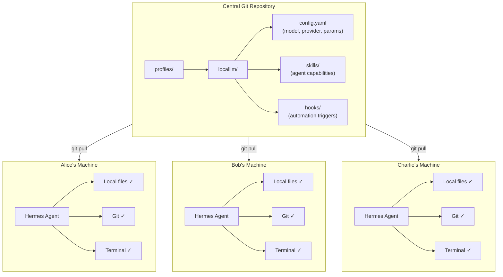

# We Gave Every Team Member an AI Agent — Here's What It Took to Make Them All Think Alike

You know that moment when someone on your team shows you an AI-generated document and it's… different? Different tone, different structure, different quality. And then you realize: they're using a different model. Or a different temperature setting. Or some prompt they found on Reddit six months ago.

That's when it hits you. AI tools are powerful, but they're also *non-deterministic*. Two people running the same task with slightly different configurations will get different results. Multiply that across a team of ten, and you don't have an AI-assisted workflow — you have chaos with better grammar.

I went through this realization firsthand. What started as "let's give everyone access to an AI tool" turned into a deeper question: how do you make an entire team's AI experience consistent — same models, same skills, same behavior — without locking them into a rigid web interface that can't touch their actual tools?

This is the story of that journey.

---

## The Problem That Sneaks Up on You

Introducing AI into a team's workflow sounds simple on paper. Pick a tool, give everyone access, done. But non-deterministic AI has a property that deterministic software doesn't: *identical inputs do not guarantee identical outputs*. And when outputs vary, consistency becomes the foundation everything else rests on.

It's not just about the model. It's about **everything**:

- **The model itself** — which version, which quantization, which endpoint
- **The skills** — the reusable workflows and capabilities the AI has
- **The hooks** — the automation triggers that fire before or after actions
- **The configuration parameters** — temperature, context length, system prompts, tool access

Change any one of these and you change the output. Change them differently for different people, and you've built a machine that produces inconsistent results *by design*.

The core insight is this: for AI to be a team tool rather than a personal toy, the configuration has to be as shared and versioned as the codebase itself.

---

## First Attempt: The Central Server Dream

The obvious answer is centralization. Host everything on one server, give everyone a web browser, and call it a day.

We set up **Open WebUI** — a polished, open-source chat interface — on a central machine. It served a single model, with a single configuration, to everyone through their browser. No installations. No version conflicts. No "which model are you on?" conversations.

For a while, it worked beautifully.

But then the cracks appeared. Someone wanted the AI to read a file from their locally synced SharePoint folder. Someone else wanted it to interact with a Git repository. A third person needed it to run terminal commands as part of a multi-step workflow.

And that's where the central-server model hit its ceiling.

Open WebUI is a web interface. It lives in a browser tab. It can't `git diff` your local repository. It can't traverse your file system. It can't launch terminal processes. These aren't bugs — they're architectural constraints. A web app, no matter how well-designed, can't be an *agent*.

The conclusion was uncomfortable but clear: to get agent capabilities — real integration with local tools and file systems — the AI has to run on the local machine. But we still needed the consistency of a central configuration.

We needed both things at once.

---

## The Architecture That Actually Worked

That's when we found **Hermes Agent**, an open-source AI agent framework from Nous Research, and specifically its **profile system**.

Here's the architecture that solved the problem:



The magic is in the separation of concerns: **the agent runs locally, the configuration lives centrally**.

Hermes profiles are plain directories — YAML configs, markdown skill definitions, hook scripts — stored in Git. Before starting Hermes, each team member pulls the latest profile from the repository. The agent then reads that profile and runs with the exact same models, skills, and parameters as everyone else.

But because the agent executes *locally*, it has full access to the user's machine: their file system, their synced SharePoint folders, their Git repositories, their terminal. No web interface sandbox. No "sorry, I can't access that."

This is the best of both worlds: the consistency of a central server with the power of a local agent.

---

## Why Hermes Specifically?

There are other agent frameworks. What made Hermes the right fit came down to a few specific design decisions:

**Profiles are just files.** There's no database to sync, no server to configure, no proprietary format. A profile is a directory. You clone it, you run it. That's it.

**Git-native collaboration.** Because profiles are directories of text files, they work with every Git workflow the team already uses. Feature branches for new skills. Pull requests for configuration changes. Code review before anything goes live. The same process that governs the team's software also governs its AI.

**Skills are shareable and composable.** Hermes skills are self-contained markdown documents with YAML frontmatter — instructions, scripts, templates, and references all in one directory. Write a skill once, commit it to the shared profile, and every team member gets it on their next `git pull`.

**Model flexibility.** The profile specifies which model to use, but Hermes can also fall back to a locally configured provider. This means the team profile can point to a shared local LLM server (we use a Qwen3-32B model running on internal hardware), while each user can also have a personal fallback to a cloud API for tasks that need more power.

---

## The Team Workflow for AI Configuration

One of the most important design decisions was treating AI configuration the same way we treat code. No one edits the production config by hand. Changes go through review.

Here's what that looks like in practice:

1. **Someone has an idea.** Maybe it's a new skill for generating compliance documents. Maybe it's a tweak to the system prompt that produces better results.

2. **They create a branch.** `git checkout -b feature/compliance-skill` — same as any code change.

3. **They make the change.** A new skill file in `skills/`, an updated parameter in `config.yaml`, a new hook script. The profile directory is their workspace.

4. **Pull request and review.** Other team members look at the change. Does the skill work? Are the model parameters reasonable? Will this break anyone's workflow?

5. **Merge and deploy.** Once approved, the change lands in `main`. Every team member gets it on their next `git pull`. No deployment scripts, no server restarts, no configuration drift.

The beautiful thing about this workflow is that it requires zero new tools. The team already knows how to branch, commit, review, and merge. AI configuration management simply inherits the team's existing software engineering discipline.

---

## Setting It Up: From Zero to Shared Agent in Three Steps

If you want to replicate this setup, here's the concrete path.

### Prerequisites

- A Linux or macOS machine (Windows works through WSL)
- Git installed
- Access to your team's shared profile repository

### Step 1: Clean Slate

Start fresh. Remove any existing Hermes configuration that might conflict:

```bash
cd ~
rm -rf ~/.hermes
```

### Step 2: Install Hermes Agent

The official installer handles everything — core binaries, Python virtual environment, and an interactive setup wizard:

```bash
curl -fsSL https://hermes-agent.nousresearch.com/install.sh | bash
```

The wizard walks you through a series of choices. For a team setup, the key decisions are:

| Setup Step | Recommendation |
|------------|---------------|
| Installation type | Full Setup |
| Fallback LLM provider | Your choice (OpenAI, Anthropic, etc.) |
| Terminal backend | Keep default |
| External platforms | Skip |
| CLI tools | Keep default selection |
| Browser provider | Local Browser |
| Image generation | Skip |
| Text-to-speech | Skip |
| Vision backend | Skip |
| Search provider | DuckDuckGo |

The fallback provider matters because it's what Hermes uses when no profile is specified — useful as a personal backup or for tasks that need frontier-model reasoning.

### Step 3: Link the Shared Profile

This is the critical step. The wizard creates an empty `~/.hermes/profiles` directory. Replace it with a symlink to your team's shared profile repository:

```bash
# Clone the team repo if you haven't already
git clone git@github.com:your-team/hermes-profiles.git /path/to/team-profiles

# Replace the empty directory with a symlink
rm -rf ~/.hermes/profiles
ln -s /path/to/team-profiles/profiles ~/.hermes/profiles
```

That's it. Now when you run Hermes with the team profile, it transparently reads all configuration from your local Git clone — which you keep in sync with `git pull`.

### Using the Team Profile

```bash
# Launch with the shared team configuration
hermes chat --profile localllm

# Or use your personal fallback model
hermes chat
```

### What Happens Behind the Scenes

When you run `hermes chat --profile localllm`, three things happen:

1. **The core engine starts** using the Hermes installation from Step 2 — the CLI binary, the Python environment, the system dependencies.

2. **The profile is loaded** from the symlinked Git repository — the model configuration, the skills, the hooks. Everything the agent needs to behave like every other team member's agent.

3. **Data stays local.** Conversation history, execution logs, and personal API tokens live in your `~/.hermes` directory (in files excluded from the shared repository by `.gitignore`). No sensitive data ever reaches the team repository or the central server.

---

## What We Learned

After rolling this out across the team, a few lessons became clear:

**1. Consistency isn't just about the model.** We initially thought "same model = same results." Wrong. Skills, hooks, system prompts, and even tool access permissions all affect output. The profile system covers all of these, not just the model name.

**2. Git is the right synchronization primitive.** We considered configuration databases, API-driven configuration servers, even shared network drives. Git won because it's battle-tested, every developer already has it, and it gives you branching, history, review, and rollback for free.

**3. Local execution is worth the setup cost.** Yes, installing an agent on every machine is more work than pointing everyone at a web UI. But the payoff — real file system access, Git integration, terminal commands — is the difference between a chatbot and an AI teammate.

**4. The web UI wasn't wrong, just insufficient.** Open WebUI is excellent for what it does. For pure chat interactions, it's hard to beat. But when your workflow involves files, repositories, and multi-step automation, you need an agent, not an interface.

**5. Review processes protect quality.** Putting AI configuration through the same PR review as code means bad prompts get caught before they reach the team. It also creates a shared understanding — when someone reviews your skill, they learn how it works, and the team's AI literacy grows organically.

**6. Data security is simpler than it seems.** Because the agent runs locally and the profile contains only configuration (no data, no tokens, no history), the shared repository stays clean. The `.gitignore` in the Hermes installation handles the rest.

---

## The Bigger Picture

What we've built here isn't just a way to share AI configurations. It's a pattern for how teams will manage AI tooling in general.

Think about it: as AI agents become more capable, they also become more configurable. More skills. More hooks. More parameters that subtly influence behavior. The difference between a well-configured agent and a poorly configured one grows with every new capability.

Centralized approaches — the web UI model — will always be simpler to set up. But they'll also always hit a ceiling on integration depth. Local approaches — the agent model — will require more initial investment but repay it with genuine system integration.

Hermes profiles give you a way to have both: the consistency of centralized configuration with the power of local execution. And because it's built on Git, it doesn't ask the team to learn anything new.

The future of AI in teams isn't about which model is best. It's about how you make sure everyone is using it the same way.

---

## Further Reading

- [Hermes Agent Documentation](https://hermes-agent.nousresearch.com/docs) — The full platform documentation
- [Nous Research](https://nousresearch.com) — The team behind Hermes Agent
- The profile system and skill authoring guide are part of the Hermes documentation
