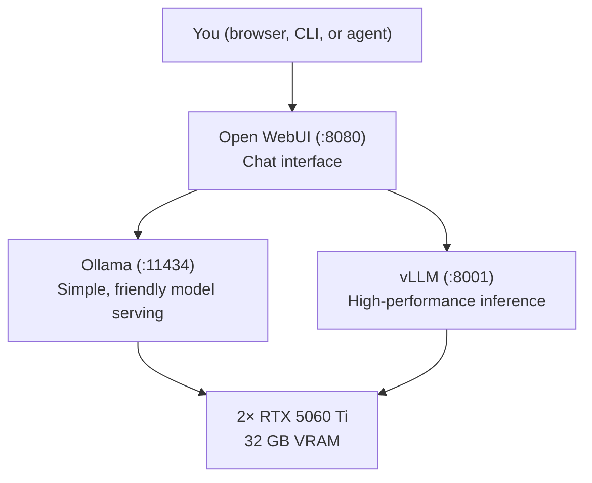
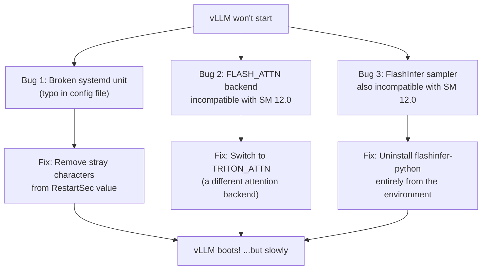
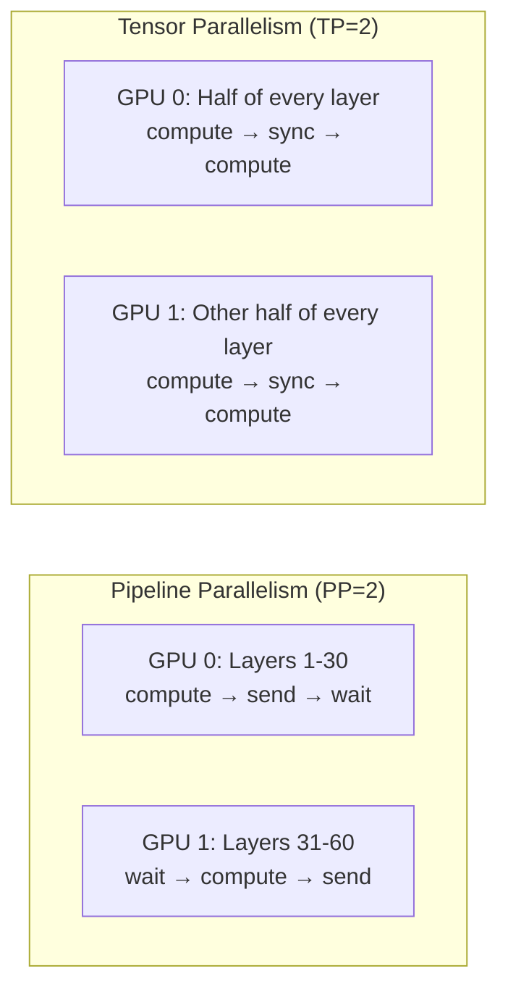

# I Built My Own AI Server — Here's What I Learned About Running Frontier Models at Home

We've all been there: you send a prompt to Claude or GPT-5, wait a few seconds, and wonder — *could I do this myself?* Not out of arrogance, but curiosity. What does it actually take to run a 32-billion-parameter language model on your own hardware, in your own home, without sending a single byte to the cloud?

I set out to find out. I bought the hardware, installed the software, fought the bugs, and benchmarked the results. What I found was a landscape that is simultaneously more accessible and more chaotic than I expected. The tools exist. The models are free. The hardware is affordable. But putting it all together? That's still an adventure — one I want to share with you.

---

## Why Bother With a Local AI Server?

The case for running AI locally is compelling on paper:

- **Privacy**: Your data never leaves your network.
- **Cost**: No per-token API fees that scale unpredictably.
- **Control**: You choose the model, the configuration, and the rules.
- **Learning**: There's no better way to understand these systems than running them yourself.

But there's also an honest reason: I wanted to see if a 32-billion-parameter open-source model could actually hold its own against the frontier models from Anthropic and OpenAI. The answer, as you'll see, is nuanced.

---

## The Hardware: Keeping It Realistic

I didn't want to go all-in financially. The goal was to build something that could *seriously* run AI agents — not a toy, but not a $20,000 GPU workstation either. Here's what I landed on:

| Component | Choice | Why |
|-----------|--------|-----|
| **GPU** | 2× NVIDIA RTX 5060 Ti (16 GB each) | 32 GB total VRAM — enough for a 32B model |
| **CPU** | AMD Ryzen 9 9950X (16 cores) | Fast enough for data preprocessing and orchestration |
| **RAM** | 64 GB DDR5 | Buffer for model weights and context overflow |
| **Storage** | 2 TB NVMe SSD | Fast model loading and KV cache spill |


The RTX 5060 Ti is interesting. It's NVIDIA's newest **Blackwell** architecture (compute capability SM 12.0) — powerful, but so new that much of the AI software ecosystem hadn't caught up yet. That decision alone would cause me weeks of headaches, as we'll see.

The total build came in at a fraction of what a cloud GPU instance would cost over a year. And as a bonus? I could install Windows on the side and play games when I wasn't experimenting with AI. :)

---

## The Software Stack: Three Engines, One Server

The open-source LLM ecosystem has consolidated around a few key tools. I chose a stack of three:



- **[Ollama](https://ollama.com/)**: The easy option. Download a model, run it, chat with it. Great for experimentation.
- **[vLLM](https://docs.vllm.ai/)**: The serious option. Built for throughput — parallel requests, efficient memory management, and production-grade serving.
- **[Open WebUI](https://openwebui.com/)**: A beautiful chat interface that connects to either engine.

A critical design decision: **only one inference engine runs at a time.** Both Ollama and vLLM need the full 32 GB of VRAM to serve a 32-billion-parameter model. Running them simultaneously would cause one to crash with an out-of-memory error. I automated the switching with a single configuration toggle:

```yaml
# One variable controls everything
inference_engine: "vllm"   # or "ollama"
```

When you flip this value, Ansible (my automation tool of choice) stops one engine, starts the other, and reconfigures the web interface to point at the right one. Clean and simple.

---

## The Blackwall: When New Hardware Meets Immature Software

Here's where the story gets interesting. The RTX 5060 Ti uses NVIDIA's Blackwell architecture, internally known as **SM 12.0**. It's powerful hardware, but vLLM — the inference engine I needed for serious work — had barely been tested on it.

The first time I tried to start vLLM, it crashed immediately. The error messages were cryptic:

```
undefined symbol: check_cuda_arch
RuntimeError: FlashInfer requires GPUs with sm75 or higher
```

This was baffling. SM 12.0 *is* higher than SM 7.5. The problem? The FlashInfer library — vLLM's default attention backend — had a JIT compiler that simply didn't know how to handle Blackwell GPUs yet. It saw an architecture number it didn't recognize and panicked.

This wasn't just one bug. It was a cascade of three independent problems, each hiding behind the other:



The fix for the attention backend was to switch from `FLASH_ATTN` to **`TRITON_ATTN`** — a different implementation that happened to work on Blackwell. But FlashInfer kept resurfacing in unexpected places: not just for attention, but also for the *sampler* (the component that picks which word comes next). Eventually, the only reliable solution was to completely remove the FlashInfer package from the Python environment, forcing vLLM to use its fallback paths everywhere.

This took days of debugging, reading GitHub issues, and testing configurations. It's a reminder that in fast-moving open-source ecosystems, being on the cutting edge of hardware means you *are* the QA team.

---

## The VRAM Puzzle: Fitting a 32-Billion-Parameter Model Into 32 GB

A 32-billion-parameter model like **Qwen3-32B** is a large piece of software. In its compressed AWQ (4-bit quantized) form, the model weights take up about **19 GB** of VRAM. That leaves roughly 13 GB for the **KV cache** — the working memory the model uses to track the conversation context.

Here's the math that kept me up at night:

| Context Length | KV Cache (fp16) | KV Cache (fp8) | Fits? |
|---------------|-----------------|----------------|-------|
| 32K tokens | ~8 GB | ~4 GB | ✅ (with fp8) |
| 64K tokens | ~16 GB | ~8 GB | ✅ (with fp8, tight) |
| 128K tokens | ~32 GB | ~16 GB | ❌ |

At standard precision (fp16), even 32K tokens of context wouldn't fit alongside the model weights. The breakthrough was switching the KV cache to **fp8** — a half-precision floating point format that Blackwell supports natively. This halved the memory requirement with virtually no quality loss, letting me serve conversations up to 64K tokens long.

### Splitting Across Two GPUs

Since the 19 GB model doesn't fit on a single 16 GB card, it must span both GPUs. There are two ways to do this:



**Pipeline Parallelism** splits the model in half — GPU 0 handles the first 30 layers, GPU 1 handles the last 30. The problem? While GPU 0 is working, GPU 1 sits idle, and vice versa. For a single conversation, this wastes about 50% of available compute.

**Tensor Parallelism** splits each layer across both GPUs, so they're always working together. The cost? They need to exchange data after every single layer — and on consumer GPUs without NVLink (NVIDIA's high-speed GPU-to-GPU connection), that data has to travel through the motherboard's PCIe bus, which is slow.

I tested both. For my use case (a personal AI agent handling 1-4 requests at a time), the communication overhead of Tensor Parallelism was roughly equal to the idle-time waste of Pipeline Parallelism. I ended up choosing Pipeline Parallelism because it was more stable on my specific hardware — GeForce cards have known issues with P2P (peer-to-peer) GPU communication that can cause deadlocks.

---

## Automation: Because Doing It Twice Is Doing It Wrong

The setup process was complex enough that I automated it with **Ansible** — a tool that lets you describe your entire server configuration as code. The result: a single command that installs NVIDIA drivers, Docker, Ollama, vLLM, Open WebUI, downloads models, and configures everything:

```bash
# One command, 30-90 minutes later, you have a working AI server
ansible-playbook -i inventory.ini site.yml --ask-become-pass
```

The Ansible project grew to include:

- **Roles** for each component (NVIDIA drivers, Docker, Ollama, vLLM, Open WebUI)
- **Mutual exclusion logic** that ensures only one engine runs at a time
- **Model download tasks** that pull the right quantized models from HuggingFace
- **A test playbook** that verifies everything is working after installation
- **An update playbook** for keeping components current

This was essential. When you're debugging driver incompatibilities and attention backend failures, you need to be able to tear everything down and rebuild from scratch in minutes, not hours.

---

## Performance: The Honest Numbers

After all the configuration, optimization, and debugging, what did I actually get?

**~20 tokens per second** for single-stream generation with Qwen3-32B-AWQ.

To put that in context: that's roughly 15 words per second — readable in real time, but noticeably slower than ChatGPT or Claude, which typically deliver 40-80+ tokens per second through their cloud infrastructure.

Where does the time go? The biggest bottleneck is the **pipeline parallelism bubble** — that 50% idle time I mentioned earlier. Here are the optimizations I identified and tested:

| Optimization | Expected Improvement | Status |
|-------------|---------------------|--------|
| Switch to Tensor Parallelism | +15-30% at low concurrency | Tested — marginal gain |
| Enable prefix caching | +30-50% time-to-first-token | Implemented |
| Speculative decoding (small draft model) | +50-100% decode speed | Planned |
| NVFP4 quantization (Blackwell-native) | +17% if available | Waiting for model checkpoint |
| Reduce context window to 32K | More VRAM for batching | Available if 64K not needed |
| Push GPU utilization to 95% | Small but free | Implemented |

The most promising path forward is **speculative decoding**: using a tiny model (like Qwen3-0.6B) to quickly generate candidate tokens, which the large model then verifies in parallel. This could potentially double the throughput to 40-55 tokens per second — competitive with cloud APIs.

---

## Real-World Testing: Can It Replace Claude?

I put the local setup to the test with the **Hermes agent** — an open-source AI agent framework — running real development tasks:

- Writing project documentation for a codebase
- Generating test cases
- Drafting pull request descriptions
- Small and large code refactoring suggestions

The results were honest and humbling:

**Documentation** was useful but lacked depth. The model captured the high-level structure but missed important details that a human reviewer would need to fill in.

**Test cases** were mostly correct but overlooked edge cases and contained minor errors — good as a starting point, not as a final product.

**Pull request descriptions** were generally good but sometimes lacked clarity.

**Refactoring suggestions** were the weakest area. The model sometimes made the code *worse*, and the response times were long enough to break the flow of interactive development.

The verdict: a 32-billion-parameter local model is not yet a replacement for frontier cloud models when it comes to complex code understanding and generation. It's a capable first-draft machine that still requires significant human review.

### A More Promising Use Case

But there's a second use case I'm more optimistic about: **compliance documentation**. Generating ISO 27001 and ISO 62304 compliant documents — security policies, risk assessments, compliance reports — from unstructured customer input. This is fundamentally a text-generation-from-template task rather than deep code analysis, and early signs suggest the model handles it better. The structured, formulaic nature of compliance documents plays to the strengths of a quantized model.

---

## What I'd Tell Someone Starting Today

If you're thinking about building your own AI server, here's what I learned:

1. **The hardware is ready.** Consumer GPUs with 16+ GB of VRAM can genuinely run useful 30B+ parameter models. The price-to-performance ratio is compelling.

2. **The software is still catching up.** Especially on newer GPU architectures. Budget significant time for debugging if you're on cutting-edge hardware. If stability matters more than bleeding-edge performance, consider a previous-generation GPU (RTX 4090, RTX 3090) where the software ecosystem is more mature.

3. **Automation is not optional.** The number of configuration variables, environment settings, and interdependencies is too large to manage manually. Tools like Ansible, Docker, and systemd are essential.

4. **Quantization is the key that unlocks everything.** Without AWQ 4-bit quantization and fp8 KV caches, a 32B model simply wouldn't fit in 32 GB of VRAM. These techniques have matured enough that quality loss is minimal for many tasks.

5. **Set realistic expectations.** Local models at this scale are powerful assistants, not autonomous replacements. They excel at drafting, summarizing, and generating structured content — tasks where a human reviews the output. For complex reasoning and real-time interactive coding, cloud frontier models still have a clear edge.

---

## Looking Forward

The pace of progress in this space is extraordinary. When I started this project, Blackwell support in vLLM was essentially nonexistent. Within weeks, community fixes were landing in pull requests. Quantization techniques that were research papers six months ago are now one-line configuration options.

The open-source model ecosystem is also advancing rapidly. Qwen3-32B is already a capable model, and newer releases from Qwen, Llama, and DeepSeek continue to close the gap with proprietary offerings. NVFP4 quantization — designed specifically for Blackwell's hardware — promises another 17% speedup once model checkpoints become available.

Building your own AI server in 2026 is a bit like building your own PC in 1998: it requires patience, some technical knowledge, and a willingness to troubleshoot. But the reward is a deeper understanding of the technology and a system that is entirely yours — private, customizable, and free from API rate limits.

The future of AI isn't just in the cloud. It's increasingly in our homes, our offices, and our homelabs. And it's getting better every month.

---

## Further Reading

- [Project Source on GitHub](https://github.com/tmseidel/local-llm-setup) — The complete Ansible playbooks, Docker configurations, and systemd units to replicate this entire setup from scratch
- [vLLM Documentation](https://docs.vllm.ai/) — The inference engine powering this setup
- [Ollama](https://ollama.com/) — The simpler alternative for getting started
- [Qwen3 Model Family](https://huggingface.co/Qwen) — The open-weight models used in this project
- [vLLM Field Report: AWQ on RTX 5060 Ti](https://www.reddit.com/r/LocalLLaMA/comments/1rwubcy/guide_awq_models_working_on_rtx_5060_ti_sm_120/?tl=de) — Community testing on Blackwell hardware
- [Open WebUI](https://openwebui.com/) — The chat interface that ties it all together
