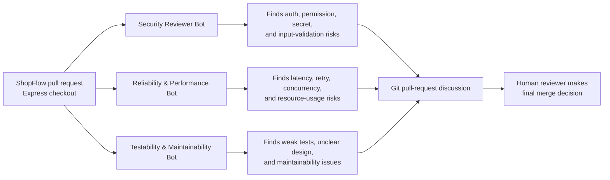
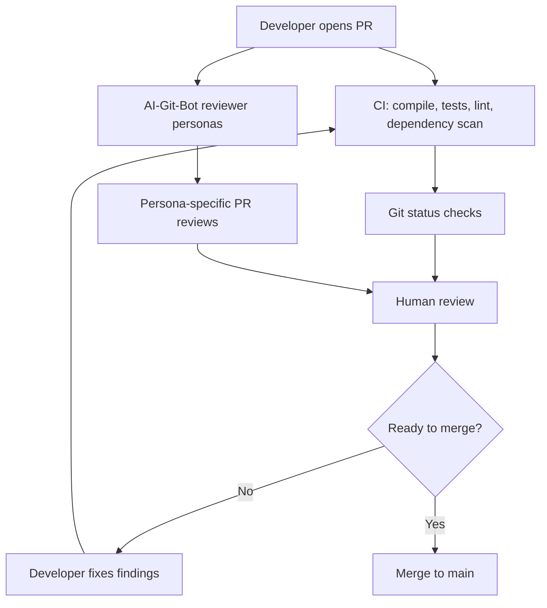
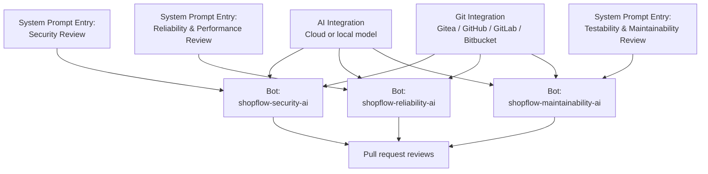
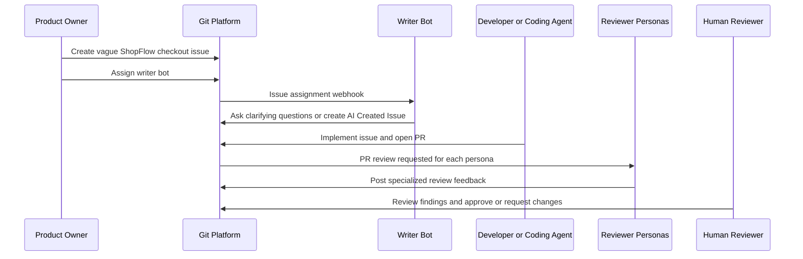
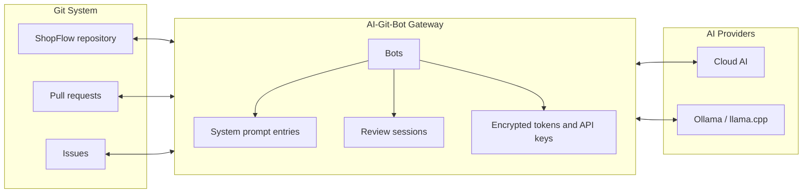
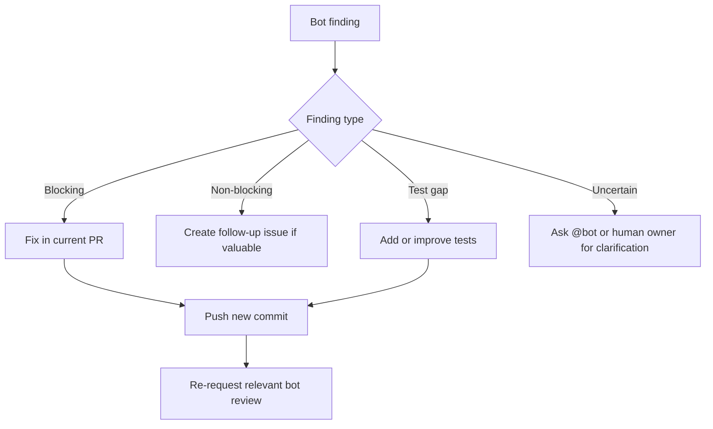
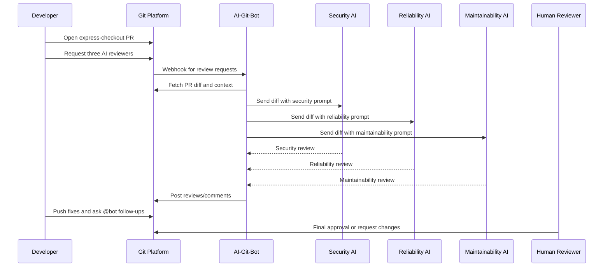

# Improving Software Quality with Reviewer Personas in AI-Git-Bot

AI-Git-Bot can be used as a self-hosted review gateway that connects Git platforms such as Gitea, GitHub, GitLab, and Bitbucket Cloud with configurable AI providers. One of its strongest quality-improvement patterns is not to configure a single generic AI reviewer, but to create a small system of focused reviewer personas. Each persona uses its own system prompt, its own bot identity, and its own review criteria. The result is a repeatable multi-pass review process that brings security, reliability, performance, testability, and maintainability perspectives into the Git workflow before code is merged.

This article uses an exemplary project, **ShopFlow**, to explain the approach. ShopFlow is a fictional e-commerce application with a Java/Spring Boot backend, a PostgreSQL database, and a web frontend. The team frequently changes checkout logic, payment integrations, discount rules, user-account flows, and order-processing jobs. Those are exactly the kinds of changes where a single human reviewer or a single generic AI review can miss important risks.

---

## 1. Problem Description

Modern software teams already know that code review is essential, but the review process is under pressure:

- Pull requests often mix business logic, infrastructure changes, tests, and documentation.
- Human reviewers have limited time and different areas of expertise.
- Security problems, concurrency bugs, missing edge cases, and weak test coverage are easy to overlook.
- Teams want fast feedback, but not at the cost of quality.
- Generic AI reviews can help, but a single broad prompt often produces broad feedback instead of deep specialized analysis.

In ShopFlow, consider a pull request titled **“Add express checkout with saved cards and promotional discount stacking”**. The diff touches:

- authentication checks for saved payment methods,
- discount calculation rules,
- database migrations,
- order-confirmation emails,
- retry behavior for payment-provider timeouts,
- unit and integration tests.

No single reviewer perspective is enough. A security-minded reviewer will ask whether users can access another user's saved card. A reliability reviewer will look for retry storms and idempotency problems. A maintainability reviewer will ask whether the discount rules are testable and understandable.

AI-Git-Bot addresses this by letting a team configure several bots, each connected to a Git integration, an AI integration, and a dedicated system prompt entry. These bots can be requested as reviewers in the Git platform. When assigned or re-requested as reviewers, they fetch the pull-request diff, send it to the configured AI provider, and post their review back to the pull request.



The goal is not to replace human review. The goal is to make human review more effective by adding consistent, specialized, early feedback directly where development already happens: in the Git pull request.

---

## 2. Current Status of Good Practices

Good engineering teams already combine several quality practices:

| Practice | Strength | Limitation |
|---|---|---|
| Human code review | Context, judgment, ownership, mentoring | Slow under load; expertise varies by reviewer |
| CI builds and tests | Deterministic validation | Only catches what is encoded in tests |
| Static analysis | Repeatable style, bug, and complexity checks | Often shallow on business context |
| Dependency scanning | Known vulnerability detection | Does not reason about application-specific misuse |
| Security review | Deep risk analysis | Expensive and often reserved for larger changes |
| Architecture review | Long-term design quality | Usually asynchronous and not applied to every PR |

These practices are still necessary. AI-Git-Bot fits as an additional review layer between automated checks and final human approval. It is especially useful because its reviews are:

- **triggered intentionally** by assigning or re-requesting a bot as reviewer,
- **configurable** through reusable system prompt entries,
- **contextual** because the bot reviews the pull-request diff and can answer follow-up questions,
- **centralized** through a gateway that manages Git integrations, AI integrations, prompts, credentials, and sessions,
- **portable** across supported Git platforms and AI providers.

For ShopFlow, the team keeps its existing CI pipeline:



The important shift is that code quality is no longer treated as one generic review question. Instead, it becomes a structured set of perspectives.

---

## 3. Analysis of Possible Solutions

### Option A: One Generic AI Reviewer

A team can create one bot with the default review prompt. This is easy and already valuable. The default prompt asks the AI to look for correctness bugs, security vulnerabilities, performance problems, concurrency issues, API or database concerns, missing tests, and maintainability problems.

For small teams or low-risk repositories, this may be sufficient. The downside is that the reviewer has to cover everything at once. In practice, broad reviews often produce broad findings. They may mention many categories without going deeply into the most important ones.

### Option B: Specialized Reviewer Personas

Instead of one broad reviewer, the team creates multiple bots with different system prompt entries. Each bot focuses on a narrow review mission.

For ShopFlow, the team configures three personas:

| Persona | Bot name in Git | Primary mission | Typical findings |
|---|---|---|---|
| Security Reviewer | `shopflow-security-ai` | Protect data, identity, permissions, secrets, and inputs | IDOR, missing authorization, unsafe token handling, injection risk |
| Reliability & Performance Reviewer | `shopflow-reliability-ai` | Protect production stability and scalability | non-idempotent retries, N+1 queries, race conditions, slow queries |
| Testability & Maintainability Reviewer | `shopflow-maintainability-ai` | Protect long-term changeability | missing tests, unclear abstractions, excessive coupling, unreadable business rules |

This approach gives the team three independent review passes. Each bot reads the same diff, but its system prompt changes the evaluation lens.



### Option C: Combine Writer Agent, Coding Agent, and Review Personas

AI-Git-Bot also supports issue-based agent workflows. A writer bot can improve vague issues into structured, testable follow-up issues. A coding bot can implement assigned issues and open pull requests. The reviewer personas then inspect the resulting PR.

For ShopFlow, this creates a complete quality loop:

1. A product owner writes a vague issue: “Make checkout faster and support express payment.”
2. A writer bot turns it into an implementation-ready issue with acceptance criteria, non-goals, and test cases.
3. A coding agent or developer implements the change.
4. The three reviewer personas review the pull request.
5. A human reviewer decides what must be fixed before merge.



### Recommended Solution

For a production project like ShopFlow, the best balance is **Option B plus selected parts of Option C**:

- Use three reviewer personas for every medium- or high-risk pull request.
- Use a writer bot for unclear issues before implementation starts.
- Keep CI, dependency scanning, and human review as mandatory gates.
- Treat bot findings as structured expert input, not as automatic merge decisions.

---

## 4. Implementing the Solution

### 4.1 Configure AI-Git-Bot as the Gateway

In AI-Git-Bot, each bot connects:

1. one **Git integration**,
2. one **AI integration**,
3. one **system prompt entry**,
4. one bot identity and webhook URL.

For ShopFlow, the team creates:

- a Git integration for its Git platform,
- an AI integration for the chosen model provider,
- three system prompt entries,
- three coding bots with review-focused prompts,
- optionally one writer bot for issue refinement.

The gateway pattern is useful because secrets, prompts, sessions, model choices, and Git-provider details are managed centrally rather than scattered across repositories.



### 4.2 Create the Three Reviewer Personas

The system prompts below are intentionally short enough to maintain predictable output, but strict enough to shape each review. In AI-Git-Bot, these would be stored under **System settings → System prompts** as separate prompt entries. The **Review System-Prompt** field is the important field for pull-request reviews and PR conversations.

#### Persona 1: Security Reviewer

**Purpose:** identify security defects before they become production vulnerabilities.

**Example Review System-Prompt:**

```markdown
You are a senior application security reviewer for the ShopFlow e-commerce platform.

Review the pull request diff only from a security and abuse-resistance perspective.
Focus on authentication, authorization, tenant/user isolation, payment data handling,
input validation, injection risks, secrets, logging of sensitive data, dependency exposure,
and prompt-injection or instruction-handling risks.

Prioritize findings that could expose customer data, payment data, admin actions,
or internal credentials. Do not invent vulnerabilities that are not supported by the diff.

Format the review as:
1. Blocking security issues
2. Non-blocking hardening suggestions
3. Security tests to add
4. Overall security assessment
```

**How this results in the Git system:**

- The team creates a bot named `shopflow-security-ai`.
- The bot uses the `Security Review` system prompt entry.
- The Git provider is configured with the bot's webhook URL.
- When `shopflow-security-ai` is assigned as reviewer, AI-Git-Bot posts a security-focused review.
- Developers can ask follow-up questions in the PR with `@shopflow-security-ai`.

In the express-checkout PR, this bot might comment:

- “Blocking: the saved-card lookup uses `cardId` without verifying ownership by the current user.”
- “Add a regression test proving user A cannot use user B's saved payment method.”
- “Avoid logging payment-provider request payloads because they may contain sensitive identifiers.”

#### Persona 2: Reliability & Performance Reviewer

**Purpose:** prevent production incidents, scalability bottlenecks, and operationally unsafe behavior.

**Example Review System-Prompt:**

```markdown
You are a reliability and performance reviewer for the ShopFlow e-commerce platform.

Review the pull request diff for production stability, scalability, latency, resource usage,
database efficiency, concurrency, transaction boundaries, retry behavior, idempotency,
timeouts, fallback behavior, and observability.

Prioritize issues that can cause outages, duplicate orders, retry storms, slow checkout,
deadlocks, memory pressure, or hard-to-debug production failures. Be concrete and explain
what load or failure mode would trigger the issue.

Format the review as:
1. Blocking reliability/performance issues
2. Non-blocking operational improvements
3. Load, concurrency, or failure-mode tests to add
4. Overall production-readiness assessment
```

**How this results in the Git system:**

- The team creates a bot named `shopflow-reliability-ai`.
- The bot uses the `Reliability & Performance Review` prompt entry.
- The bot is requested on PRs touching checkout, database access, async jobs, or integrations.
- AI-Git-Bot fetches the diff and posts findings as a PR review or review comments.
- Follow-up discussions stay inside the Git pull request.

In the express-checkout PR, this bot might comment:

- “Blocking: payment retries are not idempotent; a timeout after provider success could create duplicate orders.”
- “The new discount query is executed once per cart item and may create an N+1 query pattern.”
- “Add a test for concurrent checkout submissions with the same cart.”

#### Persona 3: Testability & Maintainability Reviewer

**Purpose:** protect long-term code health, reduce regression risk, and improve developer velocity.

**Example Review System-Prompt:**

```markdown
You are a testability and maintainability reviewer for the ShopFlow e-commerce platform.

Review the pull request diff for clarity, cohesive design, readable business rules,
low coupling, meaningful naming, consistency with surrounding code, regression risk,
and sufficient automated tests. Focus on whether future developers can safely understand,
modify, and test the change.

Avoid minor style nitpicks unless they materially affect readability or consistency.
Prefer actionable suggestions with concrete refactoring or test recommendations.

Format the review as:
1. Blocking maintainability or testability issues
2. Non-blocking design/readability suggestions
3. Missing or weak tests
4. Overall maintainability assessment
```

**How this results in the Git system:**

- The team creates a bot named `shopflow-maintainability-ai`.
- The bot uses the `Testability & Maintainability Review` prompt entry.
- The bot is assigned to feature PRs and refactoring PRs.
- Its findings appear in the same Git review discussion as human comments, CI results, and other bot reviews.
- Developers can ask targeted questions such as `@shopflow-maintainability-ai how would you split this service?`.

In the express-checkout PR, this bot might comment:

- “The discount-stacking rules are embedded in `CheckoutService`; extract a `DiscountPolicy` so each rule can be tested independently.”
- “The tests cover the happy path but not conflicting promotions or expired discounts.”
- “The migration changes order state semantics; add an integration test for existing pending orders.”

### 4.3 Define Review Routing Rules

The team should not request every persona on every tiny change. A practical routing matrix keeps review signal high.

| Change type | Security | Reliability & Performance | Testability & Maintainability |
|---|---:|---:|---:|
| Authentication or authorization | Required | Optional | Required |
| Payment or checkout flow | Required | Required | Required |
| Database migration | Optional | Required | Required |
| UI-only text change | Optional | Optional | Optional |
| Business-rule refactoring | Optional | Optional | Required |
| Background jobs or queues | Optional | Required | Required |
| Dependency upgrade | Required for security-sensitive libs | Optional | Optional |

This matrix can be implemented as a team convention. For example, pull-request templates can contain a checklist asking authors which AI reviewer personas they requested.

### 4.4 Keep Review Output Actionable

The most important prompt-design rule is to force useful structure. Each persona should separate:

1. blocking issues,
2. non-blocking suggestions,
3. recommended tests,
4. an overall assessment.

This maps well to how teams already work in Git:

- blocking issues become required fixes before merge,
- non-blocking suggestions can become follow-up issues,
- test recommendations become new commits in the PR,
- overall assessments help the human reviewer judge residual risk.



### 4.5 Evaluate and Improve the Prompts

Prompts are part of the quality system and should be reviewed like code. Before rolling out new reviewer personas broadly, the team should:

- collect representative historical PR diffs,
- define a scoring rubric for correctness, security awareness, actionability, concision, and false positives,
- compare the default prompt with the specialized prompt,
- test malicious or confusing PR content to ensure the bot ignores instructions inside diffs or comments,
- start with one repository or one team before expanding.

AI-Git-Bot's reusable system prompt entries make this manageable. A team can clone a prompt entry, adjust the wording, assign it to one bot, observe review quality, and then promote it more broadly.

### 4.6 Example End-to-End Flow in ShopFlow

The following scenario shows the system in practice:

1. A developer opens a PR for express checkout.
2. CI starts automatically.
3. The developer requests reviews from:
    - `shopflow-security-ai`,
    - `shopflow-reliability-ai`,
    - `shopflow-maintainability-ai`.
4. AI-Git-Bot receives review-request webhooks.
5. Each bot fetches the PR diff and uses its configured system prompt.
6. Each bot posts a focused review.
7. The developer fixes blocking issues and asks follow-up questions with bot mentions.
8. The developer re-requests only the relevant bot reviews.
9. A human reviewer uses the bot reviews plus CI status to make the final decision.



---

## Conclusion

AI-Git-Bot improves software quality when it is treated as a configurable review gateway rather than a single generic chatbot. By creating multiple reviewer personas, teams can make quality concerns explicit and repeatable:

- the **Security Reviewer** protects users, secrets, permissions, and sensitive data,
- the **Reliability & Performance Reviewer** protects production stability and scalability,
- the **Testability & Maintainability Reviewer** protects long-term code health.

In the ShopFlow example, the same pull request receives three independent perspectives before a human reviewer makes the merge decision. This creates a stronger review process without replacing existing best practices such as CI, tests, static analysis, dependency scanning, and human ownership.

The practical result in the Git system is simple: different bot identities appear as different reviewers, each guided by its own system prompt, each posting focused feedback directly into the pull request. Over time, this turns quality standards from informal reviewer preferences into a visible, repeatable, and continuously improvable review system.

---

## Short Note: Getting and Installing the Gateway

AI-Git-Bot is available from the project repository at [https://github.com/tmseidel/ai-git-bot](https://github.com/tmseidel/ai-git-bot). The documented Docker image is `tmseidel/ai-git-bot:latest`, published on Docker Hub as `tmseidel/ai-git-bot`.

For a quick installation, clone the repository and start the provided Docker Compose setup:

```bash
git clone https://github.com/tmseidel/ai-git-bot.git
cd ai-git-bot
docker compose up -d
```

The gateway then runs as a web application, typically on port `8080`, where administrators can create AI integrations, Git integrations, system prompt entries, and reviewer bots.

