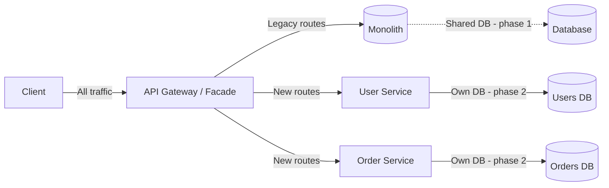
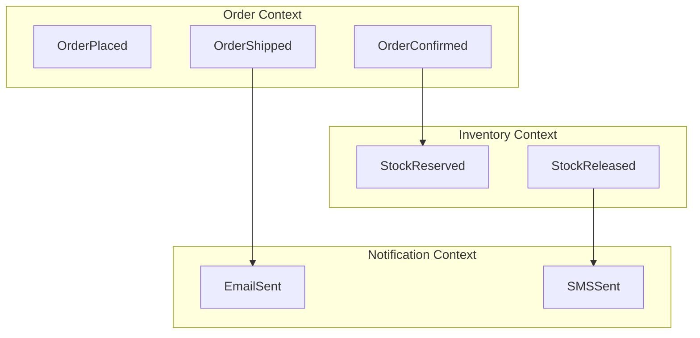
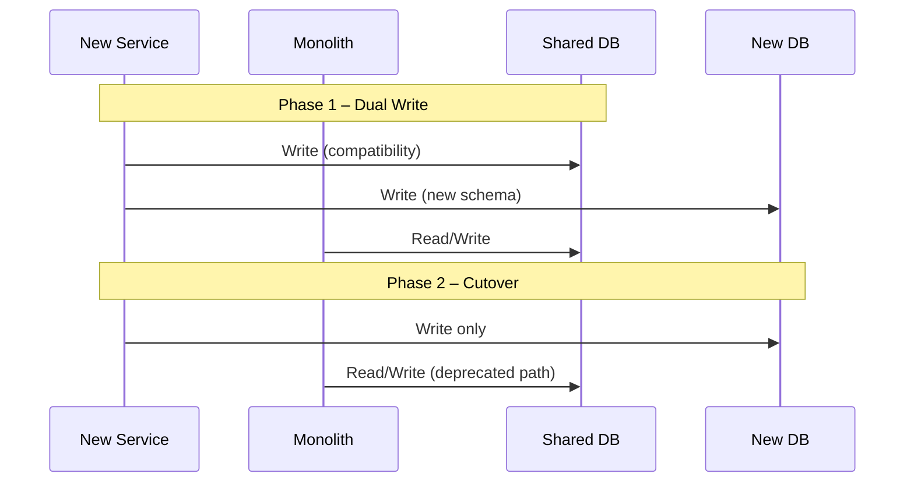

Migrating a monolithic Java application to microservices is one of the most impactful — and challenging — transformations you can undertake. This article shares the practical approach I've refined over multiple engagements.

## Why Migrate?

Before touching a single line of code, ask: *why are we doing this?* The most common drivers I encounter are:

- **Deployment bottlenecks**: A single deployable artifact blocks independent team delivery.
- **Scalability constraints**: You need to scale a specific module, not the entire application.
- **Technology modernisation**: Teams want to adopt newer frameworks or languages for specific domains.
- **Organisational growth**: Conway's Law — architecture tends to mirror team structure.

> "Never migrate for migration's sake. Identify the concrete pain point and validate that microservices solve it."

## The Strangler Fig Pattern

My go-to approach is the **Strangler Fig Pattern**: incrementally replace monolith functionality behind a facade, leaving the monolith running until it's fully strangled.

This lets you:
1. Ship value incrementally
2. Reduce risk by keeping the fallback running
3. Validate each new service before extracting the next

## Identifying Service Boundaries

Domain-Driven Design (DDD) gives us the best tools for finding service boundaries. I use **Event Storming** workshops to:

1. Map all domain events with the business team
2. Identify **bounded contexts** — areas with consistent language and ownership
3. Use bounded contexts as candidate service boundaries

## Practical Steps

### 1. Start with the API Layer

Deploy an **API Gateway** (AWS API Gateway, Kong, or a simple Spring Cloud Gateway) in front of the monolith. This gives you:
- A single entry point for traffic
- The ability to route selectively to new services
- A foundation for cross-cutting concerns (auth, rate limiting, logging)

### 2. Extract Stateless Services First

Pick a bounded context that:
- Has clear, stable APIs
- Is relatively self-contained
- Has low coupling to the rest of the monolith

Notification services, reporting modules, and authentication are often good first targets.

### 3. Database Decomposition

The hardest part. Never share a database between the monolith and a new service in the long run. The interim approach:

### 4. Embrace Eventual Consistency

With separate services comes eventual consistency. Use **domain events** over synchronous REST calls wherever possible:

- Publish events to a message broker (Kafka, RabbitMQ)
- Services subscribe to relevant events
- Saga pattern for distributed transactions

## Key Takeaways

- **Migrate iteratively** — the Strangler Fig pattern is your friend.
- **Define clear boundaries** using DDD bounded contexts.
- **Decouple the database** as a separate, explicit step.
- **Invest in observability** early — distributed tracing (Jaeger, Zipkin) and centralised logging (ELK stack) become essential.
- **Automate everything** — CI/CD per service, infrastructure as code, automated testing.

The migration journey is long, but each extracted service pays dividends in team autonomy and deployment velocity. Start small, validate, and build momentum.
