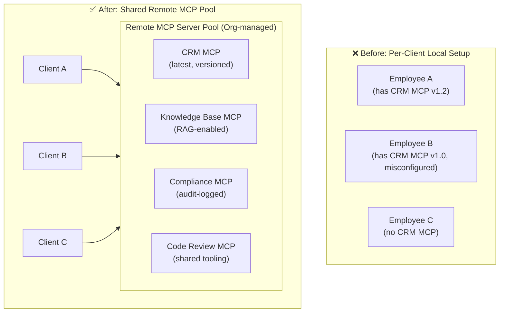
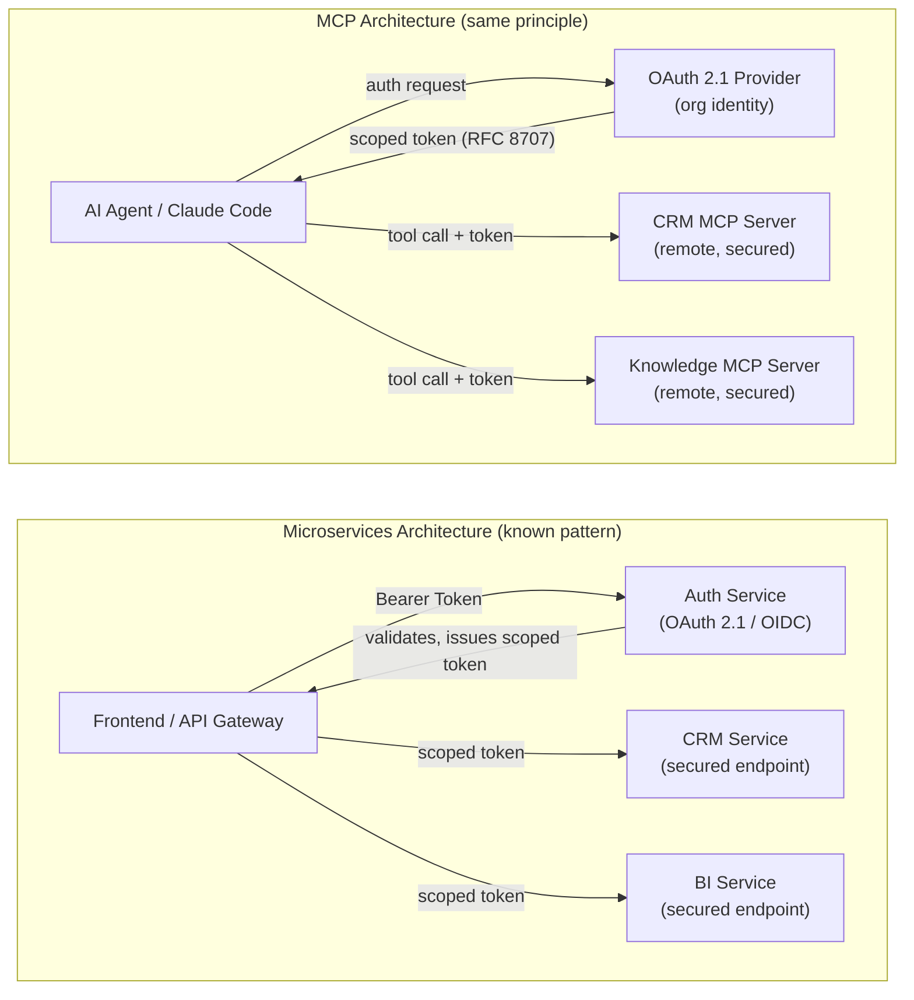
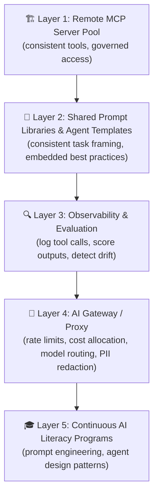

*How organizations can eliminate inconsistent AI output, unify governance, and accelerate adoption — by moving from local, per-developer tool chaos to a shared pool of remote MCP resources.*

---

## The Problem No One Talks About: AI Output Variance

Enterprise AI adoption is accelerating, but a quiet problem is eroding its ROI: **the same prompt, run by two different employees, produces dramatically different results**. This is not a model problem — it is an infrastructure problem.

The root causes are surprisingly structural:

| Factor | Description |
|---|---|
| **Client-side setup** | Each employee configures their local AI environment differently — different system prompts, context window sizes, temperature settings, or client versions |
| **Prompt engineering skill gap** | Employees vary widely in their ability to write effective prompts, leading to wildly different output quality for identical tasks |
| **Installed local tools & MCP servers** | One developer has a CRM MCP plugin; another does not. One has an up-to-date internal knowledge tool; another is running a stale fork |
| **Model version drift** | Without pinned configurations, different clients may call different model versions |
| **Context availability** | Access to company-specific context (style guides, internal APIs, compliance rules) depends on what each user has manually configured |
| **Security posture** | API keys stored in local `.env` files, personal tokens in config files, credentials passed as environment variables — each a potential exposure point |
| **Tool versioning** | Locally installed MCP servers may lag behind in functionality or contain unfixed bugs |
| **Permissions divergence** | Without centralized access control, some employees inadvertently have access to sensitive tools they should not, and others are blocked from tools they need |

This variance has three compounding consequences that directly impact the business case for AI:

1. **Quality rework** — Outputs need manual post-processing because they don't meet the expected standard, eliminating the productivity gain
2. **Adoption stagnation** — When AI "works well for some and not others," skepticism spreads and uptake plateaus
3. **Compliance failure** — Uncontrolled tool access and inconsistent outputs make it nearly impossible to enforce data governance, GDPR obligations, or industry-specific regulations

---

## The Architectural Shift: From Local Chaos to a Shared MCP Resource Pool

The solution mirrors a pattern mature engineering organizations have known for decades: **centralize what should be consistent, and expose it through a well-governed interface**.

In the context of AI agents, this means replacing a sprawl of locally configured MCP servers with a unified, remote MCP server pool that every client in the organization connects to.



---

## Benefits of a Remote, Centralized MCP Resource Pool

Moving to shared remote MCP servers delivers benefits across multiple dimensions:

### 🔒 Security & Governance
- **Centralized secret management** — API keys, tokens, and credentials live on the server, never on employee machines
- **Unified access control** — Role-based permissions enforced at the MCP layer: the marketing team never accidentally calls a financial data tool
- **Audit trails** — Every tool call is logged centrally, making compliance reporting tractable
- **Reduced attack surface** — No credentials scattered across dozens of laptops

### 📐 Consistency & Quality
- **Single source of truth** — All agents access the same tool versions, the same data, the same business logic
- **Versioned, tested releases** — Tool updates are deployed once and take effect for all users simultaneously
- **Embedded prompt hygiene** — System prompts, context, and guardrails can be baked into server-side tool definitions, not left to individual configuration

### ⚙️ Operational Efficiency
- **Zero per-client installation** — Onboarding a new employee means one auth flow, not an afternoon of CLI setup
- **Centralized monitoring** — Error rates, latency, and usage patterns visible in one place
- **Faster iteration** — Improve a tool once, benefit everyone immediately

### 📈 Adoption & Culture
- **Consistent experience** — Every user gets the same capable toolset, reducing "it works for them but not me" friction
- **Lower barrier to entry** — Non-technical employees can use powerful agentic tools without understanding local config
- **Trust through predictability** — Repeatable, governed outputs build organizational trust in AI

---

## The Microservices Analogy: Secured Services Calling Secured Services

This architecture is not new — it is precisely the pattern that modern software engineering adopted when monoliths became unmanageable.

Consider the parallel to microservices:



Just as a well-designed microservices landscape enforces that **only authenticated, authorized clients can call sensitive services** — regardless of who wrote the calling code or where it runs — a remote MCP pool enforces that **only authenticated agents, with the right scopes, can call the right tools**.

The MCP spec adopted **OAuth 2.1 with PKCE and Resource Indicators (RFC 8707)** precisely for this reason: so that a rogue or misconfigured client cannot escalate privileges or leak tokens across service boundaries — a gap that was explicitly closed in the June 2025 spec update.

> **The bottom line:** Just as you would never let application developers hardcode database passwords into their laptops and query production directly, you should not let them hardcode MCP tool configurations either. Centralize the services; secure the boundary; govern the access.

---

## Quick Start: Connecting Claude Code CLI to Remote MCP Servers

The good news is that connecting to a remote MCP server requires only a single command. Here is a practical walkthrough using Claude Code (the CLI), which supports Streamable HTTP transport natively.

### Step 1: Add a remote MCP server

```bash
# Basic remote server (Streamable HTTP)
claude mcp add --transport http <server-name> https://mcp.your-org.com/crm

# With a scope — "project" commits to .mcp.json (shareable via git)
claude mcp add --transport http --scope project crm-mcp https://mcp.your-org.com/crm

# With a static auth header (for servers not using OAuth)
claude mcp add --transport http --scope user analytics-mcp https://mcp.your-org.com/analytics \
  --header "Authorization: Bearer ${ORG_MCP_TOKEN}"
```

### Step 2: Authenticate via OAuth (if the server requires it)

```bash
# Inside a Claude Code session, trigger the OAuth flow
/mcp
# Select the server name, press Enter
# Claude Code opens a browser tab for org SSO / OAuth consent
# After consent, the token is stored automatically
```

### Step 3: Add via JSON (ideal for scripting or CI/CD provisioning)

```bash
# For automated onboarding scripts
claude mcp add-json crm-mcp '{
  "type": "http",
  "url": "https://mcp.your-org.com/crm"
}'
```

### Step 4: Verify the connection

```bash
claude mcp list
# → crm-mcp    https://mcp.your-org.com/crm    ✓ connected
```

### Committing the org-wide configuration

When `--scope project` is used, Claude Code writes the server configuration to `.mcp.json` at the project root. **Committing this file to your repository means every developer who clones the repo gets the same MCP pool automatically** — no per-person setup required.

```jsonc
// .mcp.json (committed to version control)
{
  "mcpServers": {
    "crm-mcp": {
      "type": "http",
      "url": "https://mcp.your-org.com/crm"
    },
    "knowledge-base-mcp": {
      "type": "http",
      "url": "https://mcp.your-org.com/kb"
    },
    "compliance-mcp": {
      "type": "http",
      "url": "https://mcp.your-org.com/compliance"
    }
  }
}
```

> 💡 **This approach is AI-implementation agnostic.** The MCP specification is an open standard, now governed by the Agentic AI Foundation (AAIF) under the Linux Foundation, with support from Anthropic, OpenAI, Google, Microsoft, and Block. The same remote MCP servers you configure for Claude Code can be consumed by Cursor, Windsurf, the OpenAI Agents SDK, Gemini's Vertex AI Agent Builder, and any other MCP-compliant client. **Invest once in your MCP server infrastructure; benefit across your entire AI toolchain.**

---

## A Note on the Argument: Where It Holds — and Where to Be Careful

This proposal is structurally sound, but a few nuances are worth acknowledging:

**Where the argument is strong:**
- For large organizations with many AI users, the consistency and governance case is compelling and mirrors established patterns from API gateway and microservices adoption
- OAuth 2.1 at the MCP layer is not theoretical — it is spec-mandated since mid-2025 and implemented in production by major SaaS vendors
- The adoption-stagnation problem is real: inconsistent AI experiences are a documented cause of tool abandonment

**Where to be careful:**
- **Latency** — Remote MCP servers introduce network round-trips vs. local stdio. For latency-sensitive agentic loops (many sequential tool calls), this can matter. Mitigate with geographic co-location or edge deployment
- **Dependency risk** — A central MCP pool is a shared dependency. Plan for high availability from day one; a pool outage affects all agents simultaneously
- **Migration cost** — Teams with mature local setups face a real migration effort. A phased approach (critical/shared tools remote first, niche local tools later) reduces friction
- **Not a silver bullet for prompt quality** — Centralizing tools improves tool consistency, but employees with weak prompt engineering skills will still produce weaker outputs. Pair this with prompt libraries, agent templates, and training

---

## Conclusion

The variance problem in enterprise AI is not going to solve itself. As long as every employee runs their own local configuration, prompt-engineers with their own skills, and connects to their own patchwork of local tools, the delta between the best and worst AI-assisted work in your organization will remain large.

Remote MCP servers are the architectural lever that addresses the *tooling* layer of this problem — and it is the layer most amenable to centralized governance. Centralizing your MCP resource pool brings your AI agents closer to the reliability model you expect from your SaaS APIs: versioned, authenticated, monitored, and consistent for every caller.

The pattern is proven. The spec is stable. The tooling is ready.

---

## Outlook: Further Levers for AI Standardization in Your Organization

The remote MCP pool is one layer of a broader AI standardization stack. Organizations that go further will benefit from:



- **Shared prompt libraries**: Versioned, peer-reviewed prompt templates for common tasks, stored in a central repository and surfaced to all users — reducing the skill-gap effect directly
- **Observability pipelines**: Logging agent tool calls and scoring outputs over time exposes which tools are underperforming, which prompts produce the best results, and where policy violations occur
- **AI gateways**: A proxy layer (such as LiteLLM, Portkey, or a custom gateway) sitting in front of multiple model providers enables model routing, cost visibility, PII stripping, and fallback — independent of which AI client employees use
- **Agent-as-a-service**: For high-value, repeatable workflows (contract review, data extraction, report generation), encapsulate the entire agent — model, tools, system prompt, output format — as an internal service with an API, removing individual variation entirely

The organizations that will lead in AI-augmented productivity are not the ones who gave every employee access to ChatGPT or Claude. They are the ones who built the infrastructure layer that makes the output of any employee, on any client, consistently excellent.

---

*References and further reading:*
- [MCP Official Specification — Transports](https://modelcontextprotocol.io/specification/2025-11-25/basic/transports)
- [Claude Code: Connect to tools via MCP](https://code.claude.com/docs/en/mcp)
- [Anthropic MCP Connector Directory](https://docs.anthropic.com/en/build-with-claude/mcp/directory)
