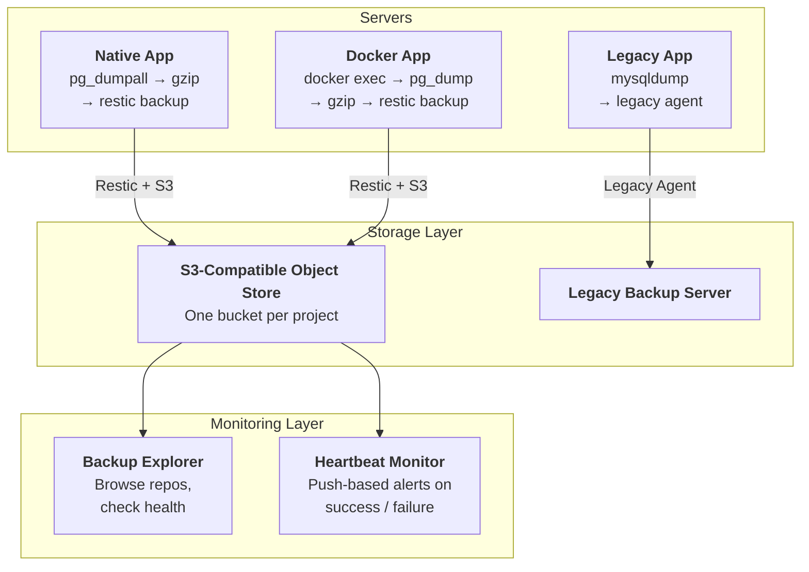

# 

**We ditched our expensive, bloated backup platform for a shell script and S3. Here's how — and what to think about before you do the same.**

---

## The Problem Nobody Wants to Touch

Let's be honest: most backup systems are set up once and then nobody looks at them again. They just… run. Hopefully.

We were in that exact spot. A centralized commercial backup server on Windows, proprietary agents on every machine, enterprise licenses, the whole deal. It worked — until it didn't:

- **The config kept breaking.** More than once, the backup server's internal state got corrupted. Trying to add a new backup job? Error dialog. Can't configure anything until someone fixes it manually.
- **Way too much overhead.** Each server needed a proprietary agent, a service user, SSH access, firewall rules — all for what's basically "copy some files somewhere safe."
- **We used 5% of the features.** Bare-metal recovery? Granular restore? Application-aware snapshots? We never used any of that. Our servers are provisioned with automation — we can rebuild them from scratch. We just needed the *data*.
- **It cost real money.** A Windows Server with commercial licenses, just to store backups. For a team that runs Linux everywhere else, that's an expensive oddball.

---

## Before You Migrate: Ask Yourself These Questions

Don't jump to a new tool just because the old one annoys you. Think it through first:

- **What are you actually backing up?** If your servers can be rebuilt from code, you probably just need data-level backups (database dumps, config files), not full disk images.
- **Have you ever restored from backup?** If the answer is "uh, I think so?" — that's your real problem, regardless of the tool.
- **What's the total cost?** Licenses + the server it runs on + agent maintenance + engineer time spent debugging weird issues.
- **Do you get alerts when a backup fails?** A backup that silently breaks is worse than no backup at all.
- **Is backup part of your provisioning?** If setting up backup for a new server is a separate manual process, it *will* get skipped eventually.

---

## What We Switched To

We landed on [Restic](https://restic.net/) — open-source, encrypts everything, deduplicates, compresses, and stores to any S3-compatible backend. It's in the default Debian repos. Install is literally `apt install restic`.

| | Old System | Restic |
|--|-----------|--------|
| **Install** | Proprietary repo + agent + service user + firewall rules | `apt install restic` |
| **Storage** | Dedicated Windows backup server | Any S3-compatible object storage |
| **Config** | GUI on backup server | Environment variables + shell script |
| **Licensing** | Per-server commercial license | Free |
| **Restore** | Through backup server UI | `restic restore` from anywhere |

When picking any replacement tool, look for: simple deployment, storage flexibility (don't get locked in), full CLI scriptability, client-side encryption, active community, and built-in retention management.

---

## The Architecture

Here's what we ended up with — three layers:



A few rules we learned the hard way:

- **One bucket per project.** Never mix backups from different apps in the same bucket. Isolation, access control, cost tracking — all easier this way.
- **Every backup is individual.** A Postgres DB needs `pg_dumpall`. A Docker service needs `docker compose exec`. A VPN server needs its config files. There's no universal "back up everything" script. Write one per app.
- **Credentials go in a team vault.** If the person who set up the backup leaves, you don't want the passwords leaving with them.

---

## The Script Pattern

After iterating across a bunch of projects, we settled on a template every backup job follows:

```bash
#!/usr/bin/env bash
set -euo pipefail

source /opt/app/.restic-env

# Error trap — always notify on failure
trap 'notify_monitor "down" "Backup failed"; rm -f "${DUMP_FILE}"; exit 1' ERR

# Init repo if first run
restic snapshots > /dev/null 2>&1 || restic init

# Create the dump (customize this per app)
pg_dumpall | gzip > "${DUMP_FILE}"

# Don't upload empty dumps
[[ -s "${DUMP_FILE}" ]] || { notify_monitor "down" "Empty dump"; exit 1; }

# Upload, clean up, prune old snapshots
restic backup "${DUMP_FILE}" --tag app-name
rm -f "${DUMP_FILE}"
restic forget --keep-daily 30 --keep-weekly 8 --keep-monthly 12 --prune

# All good
notify_monitor "up" "OK"
```

The important bits: the **error trap** makes sure you hear about failures. The **empty-dump check** catches silent breakage (like a database dump that exits 0 but produces nothing). **Retention runs on every backup**, not as a separate task. And **tags** let you filter snapshots later.

With default retention (30 daily, 8 weekly, 12 monthly) you end up with about 44 snapshots at any given time — good granularity without blowing up storage.

---

## Monitoring: Don't Skip This

Two layers — you need both:

**Heartbeat monitoring:** Every backup script pings a monitor on success or failure (we use [Uptime Kuma](https://github.com/louislam/uptime-kuma), but anything push-based works). If no ping arrives within 26 hours → alert. This catches script failures, cron being broken, and servers being down.

```bash
curl -sf "${MONITOR_URL}?status=up&msg=OK"       # on success
curl -sf "${MONITOR_URL}?status=down&msg=Failed"  # in error trap
```

**Repository browser:** A heartbeat tells you *if* the backup ran. A browser tells you *what's in it* — snapshot counts, sizes, retention compliance, integrity checks. This catches things like backups that "succeed" but are suspiciously small.

---

## How to Actually Migrate

Don't flip the switch overnight. We did it in phases:

1. **New servers get the new tool from day one.** Zero risk, no migration needed.
2. **Old servers run both systems in parallel.** Set up the new backup alongside the legacy one.
3. **Test restores from the new backup.** Actually restore on a test environment. Verify the data.
4. **Remove the legacy agent per server** after the new backup has been solid for a couple of months.
5. **Kill the legacy server last** — only after every server is migrated and validated.

Don't rush step 4. Storage is cheap. Lost data is not.

---

## TL;DR

- If your servers are provisioned from code, you don't need image-level backups. Just back up the data.
- Write a backup script per application — there is no one-size-fits-all.
- Monitor everything. Heartbeats for "did it run?", a browser for "what's in it?"
- Bake backup into your provisioning. If it's manual, it'll get skipped.
- Test your restores. A backup you've never restored from is a hope, not a strategy.
- Migrate gradually. Parallel-run, validate, then decommission.

A shell script, a cron job, encrypted uploads to S3, and a heartbeat ping. That's the whole system. No servers, no GUI, no licenses.

---

*The best backup system is the one your team actually understands, maintains, and tests.*
